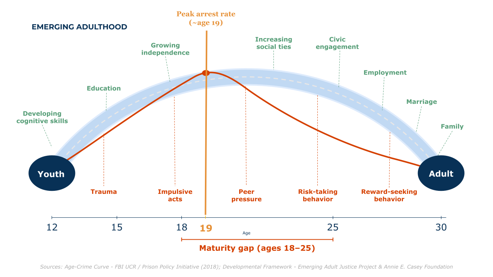

```{r setup}
#| include: false
library(dplyr)
library(tidyr)
library(ggplot2)
library(plotly)
library(scales)

# Every Pathways input here is an aggregate: group means and binned counts,
# each cell covering at least 10 interviews (smaller cells suppressed at the
# source). The person-level Pathways data never touches this repo. The public
# benchmark numbers come from federal statistical reports, each cited in its
# own CSV row and under its chart.
psmi_by_age <- read.csv("data/psmi_by_age.csv", fileEncoding = "UTF-8")
ea_share    <- read.csv("data/ea_share_by_wave.csv", fileEncoding = "UTF-8")
mean_age    <- read.csv("data/mean_age_by_wave.csv", fileEncoding = "UTF-8")
score_grid  <- read.csv("data/age_score_counts_maturity.csv", fileEncoding = "UTF-8")
offending   <- read.csv("data/offending_by_age.csv", fileEncoding = "UTF-8")
capacities  <- read.csv("data/capacities_by_age.csv", fileEncoding = "UTF-8")
psmi_sex    <- read.csv("data/psmi_by_age_sex.csv", fileEncoding = "UTF-8")
public_bm   <- read.csv("data/public_age_benchmarks.csv", fileEncoding = "UTF-8")

measure_levels <- c("maturity", "self_reliance", "identity", "work_orient")
measure_labels <- c("Overall Maturity", "Self-Reliance", "Identity", "Work Orientation")

psmi <- psmi_by_age |>
  mutate(measure_f = factor(measure, levels = measure_levels, labels = measure_labels))

cap_levels <- c("impulse_control", "temperance", "future_outlook", "consideration")
cap_labels <- c("Impulse Control", "Temperance", "Future Outlook", "Consideration of Others")

caps <- capacities |>
  mutate(measure_f = factor(measure, levels = cap_levels, labels = cap_labels))

# The middle emerging_adult value contains an en dash in the CSV. Match the
# two ASCII values and let the en-dash value be the fallback, so no
# non-ASCII literal has to live in this code.
ea <- ea_share |>
  mutate(group = case_when(
    emerging_adult == "Under 18" ~ "Under 18",
    emerging_adult == "26+"      ~ "26 and up",
    TRUE                         ~ "18 to 25"
  )) |>
  left_join(select(mean_age, wave, mean_age), by = "wave")

curve_bm <- public_bm |>
  filter(chart == "age_curve") |>
  transmute(year = series, age = as.numeric(category), rate = as.numeric(value))

overrep_bm <- public_bm |>
  filter(chart == "overrep") |>
  mutate(value = as.numeric(value))

recid_bm <- public_bm |>
  filter(chart == "recidivism") |>
  mutate(value = as.numeric(value))

# Fail the CI render loudly rather than publish a wrong page (a failed
# publish leaves the previous version of the site live).
stopifnot(
  nrow(psmi) == 44, !anyNA(psmi$measure_f), !anyNA(psmi$mean),
  nrow(mean_age) == 11, nrow(ea) == 18,
  !anyNA(ea$mean_age),
  all(ea$group %in% c("Under 18", "18 to 25", "26 and up")),
  all(score_grid$n >= 10),
  nrow(offending) == 11, all(offending$n >= 10),
  all(offending$share_any >= 0 & offending$share_any <= 1),
  nrow(caps) == 44, !anyNA(caps$measure_f), all(caps$n >= 10),
  all(caps$mean >= 1 & caps$mean <= 5),
  nrow(psmi_sex) == 21, all(psmi_sex$n >= 10),
  all(psmi_sex$sex %in% c("Male", "Female")),
  all(psmi_sex$mean >= 1 & psmi_sex$mean <= 4),
  nrow(curve_bm) == 60, !anyNA(curve_bm$age), !anyNA(curve_bm$rate),
  all(curve_bm$year %in% c("1990", "2000", "2010")),
  nrow(overrep_bm) == 4,
  all(overrep_bm$value > 0 & overrep_bm$value < 1),
  nrow(recid_bm) == 10,
  all(recid_bm$value > 0 & recid_bm$value <= 100),
  !any(public_bm$source == ""), !anyNA(public_bm$source)
)

plum_dark   <- "#6b4f6c"
plum        <- "#8C6A8D"
plum_series <- "#774379"   # chroma-bumped plum: only for multi-series charts
coral_dark  <- "#c96b52"
gray_ctx    <- "#8a8a8a"   # de-emphasized context lines; always direct-labeled
line_18_col <- coral_dark

theme_cw <- function() {
  theme_minimal(base_family = "sans", base_size = 12) +
    theme(
      plot.title    = element_text(size = 14, face = "bold", color = "#3C3C3C"),
      plot.subtitle = element_text(size = 11, color = "#555555"),
      panel.grid.minor = element_blank(),
      panel.grid.major = element_line(color = "#eeeeee"),
      axis.text     = element_text(color = "#444444"),
      legend.position = "bottom",
      legend.title  = element_text(size = 10, face = "bold"),
      strip.text    = element_text(face = "bold", color = "#333333")
    )
}

# ggplotly() drops ggplot subtitles. Fold each subtitle into the plotly
# title as a smaller <br><sup> second line so it survives the conversion.
# Pipe every chart through this instead of bare ggplotly().
ggplotly_titled <- function(p, ...) {
  fig <- ggplotly(p, ...)
  sub <- p$labels$subtitle
  if (is.null(sub) || !nzchar(sub)) return(fig)
  fig |>
    layout(
      title = list(text = paste0(
        "<b>", p$labels$title, "</b><br><sup>", sub, "</sup>"
      )),
      margin = list(t = 70)
    )
}

clear_bg <- function(fig) {
  layout(fig, paper_bgcolor = "rgba(0,0,0,0)", plot_bgcolor = "rgba(0,0,0,0)")
}

# ggplotly parks a horizontal legend on top of the x-axis title. Anchor it
# below the title and pad the bottom margin. Pipe every chart that has a
# legend through this; legend-free charts do not need it. The y offset is
# relative to plot height, so shorter charts need a deeper y (and more b)
# to clear the title by the same number of pixels.
legend_below <- function(fig, y = -0.28, b = 95) {
  layout(fig,
         legend = list(orientation = "h", x = 0, y = y, yanchor = "top"),
         margin = list(b = b))
}
```

```{=html}
<style>
/* This page runs chart-forward: section prose steps down a size, and the
   card ledes (styled in site-theme.scss) carry each section's setup. */
section.level2 > p, main.content > p { font-size: 0.95rem; }
</style>
```

An adult at 18. A number that changes everything: which court hears the
case, which facility takes custody, whether a record follows case
closure. The line is exact, but the people crossing it are not. And it
wasn't drawn because 18-year-olds present any noted difference; the age
of majority is a legal definition, not a biological one.

The line at 18, as it turns out, is younger than it looks. For most of
American history the age of majority sat at 21, inherited from English
common law; twenty-one is also the age the Fourteenth Amendment wrote
into its voting provisions. Following the war drafts of WWII and
Vietnam, public and political sentiment shifted toward voting at 18, the
same age a person could be drafted to war. Congress proposed the 26th
Amendment in March 1971, the states ratified it by July, faster than any
amendment before or since, and most states soon lowered their age of
majority to match.

Each section below asks one question about young adults in the legal
system and answers it with a chart picked for that job. Most of us pick
charts the way we pick fonts, by habit. So each figure carries a short
note on why its form won. The argument reads fine without the notes. The
habit may not survive them.

## The Frame {.section-heading}

::: {.chart-card}
<p class="chart-card-lede">What does the field believe happens between 12
and 30? Supports build, risks fade, and arrests rise and fall across the
same window. I drew the two curves together: the arc of growing up laid
over the curve of desistance.</p>
{fig-alt="Diagram spanning ages 12 to 30. A blue arch runs from a circle labeled Youth to a circle labeled Adult, with supports labeled along it: developing cognitive skills, education, growing independence, increasing social ties, civic engagement, employment, marriage, family. An orange age-crime curve rises to a peak arrest rate near age 19 and falls, with risk factors labeled below: trauma, impulsive acts, peer pressure, risk-taking behavior, reward-seeking behavior. A bracket marks the maturity gap, ages 18 to 25." width="100%"}
<p class="chart-card-note">Arrest rates peaked near 19 in the years this
story covers: in 2010, more Americans were arrested at 19 than at any
other single age. Sources: FBI UCR arrest data via the Prison Policy
Initiative and the Bureau of Justice Statistics; developmental framework
from the Emerging Adult Justice Project and the Annie E. Casey
Foundation.</p>
<p class="chart-card-note"><strong>Why this chart:</strong> a diagram, not
a data chart, because its job is to hold two ideas in one picture, not to
measure them. Everything after this point is measured.</p>
:::

## The Real Curve {.section-heading}

::: {.chart-card}
<p class="chart-card-lede">Is the famous curve real? Here it is in arrest
data: robbery arrest rates by age, drawn for three different years.</p>
```{r chart-real-curve}
#| fig-height: 4.6
#| out-width: "100%"
curve_ctx  <- filter(curve_bm, year != "2000")
curve_2000 <- filter(curve_bm, year == "2000")

p_real <- ggplot(curve_bm, aes(x = age, y = rate, group = year)) +
  geom_vline(xintercept = 18, linetype = "dashed",
             color = line_18_col, linewidth = 0.5) +
  geom_line(data = curve_ctx, aes(color = year), linewidth = 0.5) +
  geom_line(data = curve_2000, aes(color = year), linewidth = 1.1) +
  geom_point(aes(color = year, text = paste0(
    "<b>", year, ", age ", age, "</b><br>",
    "Robbery arrests per 100,000: ", rate
  )), size = 1.3) +
  annotate("text", x = 26, y = 300, label = "1990",
           size = 3.2, color = gray_ctx) +
  annotate("text", x = 21.5, y = 245, label = "2000",
           size = 3.4, fontface = "bold", color = plum_dark) +
  annotate("text", x = 30, y = 80, label = "2010",
           size = 3.2, color = gray_ctx) +
  scale_color_manual(values = c("1990" = gray_ctx, "2000" = plum_dark,
                                "2010" = gray_ctx), guide = "none") +
  scale_linewidth_manual(values = c(`TRUE` = 1.1, `FALSE` = 0.5),
                         guide = "none") +
  scale_x_continuous(breaks = c(12, 18, 25, 35, 45, 55, 65)) +
  labs(
    title = "The age-crime curve, in real arrest data",
    subtitle = "U.S. robbery arrest rates by age; the cohort's era, 2000, in plum",
    x = "Age",
    y = "Robbery arrests per 100,000"
  ) +
  theme_cw()

ggplotly_titled(p_real, tooltip = "text") |> clear_bg()
```
<p class="chart-card-note">In all three years the rate peaks at 18, and
by the late 20s it has fallen by more than half. Ages are plotted at bracket midpoints,
single years to 24 and wider brackets after, which is what the FBI data
gives. Source: Bureau of Justice Statistics, Arrest in the United States,
1990-2010 (NCJ 239423), figure 12 data.</p>
<p class="chart-card-note"><strong>Why this chart:</strong> a line chart,
because the question is shape, and one emphasized line with gray context
years shows the shape holding still while the level drops. Three equal
lines would read as spaghetti, and spaghetti has no protagonist.</p>
:::

## Everywhere in the System {.section-heading}

::: {.chart-card}
<p class="chart-card-lede">How much of the system is this one age band?
Ages 18 to 24 were about one in ten Americans, so count them at each
stage.</p>
```{r chart-overrep}
#| fig-height: 3.6
#| out-width: "100%"
over <- overrep_bm |>
  mutate(
    stage = c("Share of U.S. population", "Share of all arrests",
              "Share of sentenced prisoners", "Share of state prison releases"),
    stage_f = factor(stage, levels = rev(stage))
  )
pop_share <- over$value[1]

p_over <- ggplot(over, aes(x = value, y = stage_f)) +
  geom_vline(xintercept = pop_share, linetype = "dotted",
             color = line_18_col, linewidth = 0.6) +
  geom_segment(aes(x = 0, xend = value, yend = stage_f),
               color = "#dcd5dc", linewidth = 0.8) +
  geom_point(aes(text = paste0(
    "<b>", category, "</b><br>",
    percent(value, accuracy = 0.1), "<br>",
    "Source: ", source
  )), color = plum_dark, size = 3.4) +
  geom_text(aes(label = percent(value, accuracy = 1)),
            nudge_x = 0.016, size = 3.3, color = "#3C3C3C") +
  scale_x_continuous(labels = percent_format(accuracy = 1),
                     limits = c(0, 0.33)) +
  labs(
    title = "One in ten people, three in ten arrests",
    subtitle = "Ages 18 to 24 as a share of each stage; the dotted line is their population share",
    x = "Share of stage",
    y = NULL
  ) +
  theme_cw()

ggplotly_titled(p_over, tooltip = "text") |> clear_bg()
```
<p class="chart-card-note">Population and arrests are 2010, sentenced
prisoners are yearend 2010, and prison releases (age 24 or younger) are
the 2005 cohort. Sources: Census Bureau, Statistical Abstract 2012, table
7; BJS NCJ 239423, table 3; BJS Prisoners in 2010, appendix table 13; BJS
NCJ 250975, table 1.</p>
<p class="chart-card-note"><strong>Why this chart:</strong> a dot plot,
because four shares on one scale need aligned positions, not four bar
areas. The dotted line makes the population share the ruler everything
else is measured against.</p>
:::

## The Revolving Door {.section-heading}

::: {.chart-card}
<p class="chart-card-lede">Who comes back? Follow everyone released from
state prison in 2005 for nine years, and split them by how old they were
on release day.</p>
```{r chart-recidivism}
#| fig-height: 3.8
#| out-width: "100%"
recid <- recid_bm |>
  mutate(
    series_f = factor(series, levels = c("within_year_1", "within_9_years"),
                      labels = c("Within 1 year", "Within 9 years")),
    bracket_f = factor(category, levels = rev(c(
      "24 or younger", "25 to 29", "30 to 34", "35 to 39", "40 or older"
    )))
  )
recid_wide <- recid |>
  select(bracket_f, series_f, value) |>
  pivot_wider(names_from = series_f, values_from = value)

p_recid <- ggplot(recid, aes(y = bracket_f)) +
  geom_segment(data = recid_wide,
               aes(x = `Within 1 year`, xend = `Within 9 years`,
                   yend = bracket_f),
               color = "#dcd5dc", linewidth = 0.8) +
  geom_point(aes(x = value, color = series_f, text = paste0(
    "<b>", category, "</b><br>",
    series_f, ": ", value, "% arrested<br>",
    "Source: ", source
  )), size = 3.2) +
  scale_color_manual(values = c("Within 1 year" = coral_dark,
                                "Within 9 years" = plum_series),
                     name = NULL) +
  scale_x_continuous(limits = c(30, 100),
                     labels = label_number(suffix = "%")) +
  labs(
    title = "Nine in ten of the youngest were rearrested",
    subtitle = "Percent of 2005 state prison releases arrested again, by age at release",
    x = "Percent arrested after release",
    y = NULL
  ) +
  theme_cw()

ggplotly_titled(p_recid, tooltip = "text") |> clear_bg() |>
  legend_below(y = -0.45, b = 120)
```
<p class="chart-card-note">People released at 24 or younger: 51.8 percent
arrested within a year, 90.1 percent within nine. Released at 40 or
older: 37.8 and 76.5. Source: BJS, 2018 Update on Prisoner Recidivism
(NCJ 250975), table 3.</p>
<p class="chart-card-note"><strong>Why this chart:</strong> a dumbbell,
because each age group has two linked numbers and the segment between
them is the story. Ten bars in two colors would make the reader rebuild
each pair by eye.</p>
:::

## The Study {.section-heading}

::: {.chart-card}
<p class="chart-card-lede">The charts above count young adults from the
outside. To watch growing up happen from the inside, you need the same
people measured again and again. That is Pathways to Desistance
(<a href="https://www.icpsr.umich.edu/web/ICPSR/studies/29961">ICPSR
study 29961</a>): young people enrolled in the early 2000s shortly after
each was found responsible for a serious offense, then tracked across 11
interview waves over seven years.</p>
<div style="display:flex; flex-wrap:wrap; gap:0.75rem; justify-content:space-between;">
<div style="flex:1 1 130px; text-align:center; padding:0.9rem 0.4rem; background:#faf8fa; border-radius:8px;">
<div style="font-size:1.7rem; font-weight:700; color:#6b4f6c;">1,354</div>
<div style="font-size:0.8rem; color:#666;">people followed</div>
</div>
<div style="flex:1 1 130px; text-align:center; padding:0.9rem 0.4rem; background:#faf8fa; border-radius:8px;">
<div style="font-size:1.7rem; font-weight:700; color:#6b4f6c;">11</div>
<div style="font-size:0.8rem; color:#666;">interview waves</div>
</div>
<div style="flex:1 1 130px; text-align:center; padding:0.9rem 0.4rem; background:#faf8fa; border-radius:8px;">
<div style="font-size:1.7rem; font-weight:700; color:#6b4f6c;">7</div>
<div style="font-size:0.8rem; color:#666;">years of follow-up</div>
</div>
<div style="flex:1 1 130px; text-align:center; padding:0.9rem 0.4rem; background:#faf8fa; border-radius:8px;">
<div style="font-size:1.7rem; font-weight:700; color:#6b4f6c;">14 to 26</div>
<div style="font-size:0.8rem; color:#666;">ages observed</div>
</div>
</div>
<p class="chart-card-note"><strong>Why this chart:</strong> no chart at
all. A chart needs a comparison to earn its ink, and these four numbers
are context, not contest. Set them large and let them stand.</p>
:::

Maturity here means the Psychosocial Maturity Inventory, PSMI for short:
a questionnaire scored 1 to 4, with subscales for self-reliance,
identity, and work orientation. The overall score averages the three, and
in this data it runs through age 24.

::: {.callout-warning title="Who Is in These Numbers"}
Everyone here was enrolled after a serious offense, in the juvenile and
adult systems of two large metro areas (Philadelphia and Phoenix). This
is not a portrait of all young people; it is the group the justice system
actually handles, which is exactly where the line at 18 does its heaviest
work.
:::

## The Curve That Keeps Climbing {.section-heading}

::: {.chart-card}
<p class="chart-card-lede">Does maturity finish at 18? Line up all of the
interviews by the age the person was when they gave one, and take the
mean at each age.</p>
```{r chart-curve}
#| fig-height: 4.8
#| out-width: "100%"
mat <- filter(psmi, measure == "maturity")

p_curve <- ggplot(mat, aes(x = age, y = mean)) +
  geom_ribbon(aes(ymin = mean - sd, ymax = mean + sd),
              fill = plum, alpha = 0.16) +
  geom_vline(xintercept = 18, linetype = "dashed",
             color = line_18_col, linewidth = 0.5) +
  geom_line(color = plum_dark, linewidth = 0.9) +
  geom_point(aes(text = paste0(
    "<b>Age ", age, "</b><br>",
    "Mean score: ", sprintf("%.2f", mean), "<br>",
    "Standard deviation: ", sprintf("%.2f", sd), "<br>",
    "Interviews: ", format(n, big.mark = ",")
  )), color = plum_dark, size = 1.9) +
  annotate("text", x = 18.15, y = 2.56, label = "The line: 18",
           hjust = 0, size = 3.2, color = "#555555") +
  scale_x_continuous(breaks = seq(14, 24, 2)) +
  scale_y_continuous(limits = c(2.45, 3.85), breaks = seq(2.5, 3.5, 0.5)) +
  labs(
    title = "Overall maturity keeps climbing past 18",
    subtitle = "Mean PSMI score by age at interview; band is one standard deviation each side",
    x = "Age at interview",
    y = "PSMI score (scale runs 1 to 4)"
  ) +
  theme_cw()

ggplotly_titled(p_curve, tooltip = "text") |> clear_bg()
```
<p class="chart-card-note">The mean climbs from 3.01 at 14 to 3.15 at 18
to 3.35 at 24, still rising at the edge of the data. Sixty percent of the
observed climb lands on the adult side of the line. For once, maturation
is not a threat to validity. It is the finding.</p>
<p class="chart-card-note"><strong>Why this chart:</strong> a line with a
band, because the question is trend and the band keeps the trend honest:
it shows individual spread, not a confidence interval, and the note says
so. The y axis is zoomed to the data; on the full 1-to-4 scale the climb
would flatten, so the axis choice is itself a claim, made here in the
open.</p>
:::

## Four Measures, One Shape {.section-heading}

::: {.chart-card}
<p class="chart-card-lede">Do the subscales tell different stories?
Almost: identity barely moves before 18, then does most of its growing
after, but nothing flattens at the line.</p>
```{r chart-four-measures}
#| fig-height: 5.6
#| out-width: "100%"
p_four <- ggplot(psmi, aes(x = age, y = mean)) +
  geom_vline(xintercept = 18, linetype = "dashed",
             color = line_18_col, linewidth = 0.4) +
  geom_line(color = plum_dark, linewidth = 0.7) +
  geom_point(aes(text = paste0(
    "<b>", measure_f, ", age ", age, "</b><br>",
    "Mean score: ", sprintf("%.2f", mean), "<br>",
    "Interviews: ", format(n, big.mark = ",")
  )), color = plum_dark, size = 1.4) +
  facet_wrap(~ measure_f, nrow = 2) +
  scale_x_continuous(breaks = seq(14, 24, 2)) +
  scale_y_continuous(limits = c(2.6, 3.6), breaks = seq(2.6, 3.4, 0.4)) +
  labs(
    title = "The same shape in all four measures",
    subtitle = "Mean score by age at interview; the dashed line is 18",
    x = "Age at interview",
    y = "Mean score"
  ) +
  theme_cw()

ggplotly_titled(p_four, tooltip = "text") |> clear_bg()
```
<p class="chart-card-note">Growth after 18, as a share of each measure's
observed total: identity 83 percent, overall 60 percent, work orientation
54 percent, self-reliance 53 percent.</p>
<p class="chart-card-note"><strong>Why this chart:</strong> small
multiples, because four lines in one panel would tangle and four panels
sharing both axes make slopes comparable at a glance. The shared y axis
is the whole trick, and it is only legal here because these four measures
share a scale.</p>
:::

## What Arrives After 18 {.section-heading}

::: {.chart-card}
<p class="chart-card-lede">Maturity is not one thing: the study also
measured the capacities the law's line is supposed to stand for, impulse
control, temperance, future outlook, and consideration of others.</p>
```{r chart-capacities}
#| fig-height: 3.6
#| out-width: "100%"
cap3 <- caps |>
  filter(age %in% c(14, 18, 24))

p_caps <- ggplot(cap3, aes(x = age, y = mean)) +
  geom_vline(xintercept = 18, linetype = "dashed",
             color = line_18_col, linewidth = 0.4) +
  geom_line(color = plum_dark, linewidth = 0.8) +
  geom_point(aes(text = paste0(
    "<b>", measure_f, ", age ", age, "</b><br>",
    "Mean score: ", sprintf("%.2f", mean), "<br>",
    "Interviews: ", format(n, big.mark = ",")
  )), color = plum_dark, size = 2.6) +
  facet_wrap(~ measure_f, scales = "free_y", nrow = 1) +
  scale_x_continuous(breaks = c(14, 18, 24)) +
  labs(
    title = "Every capacity keeps arriving after the line",
    subtitle = "Mean score at ages 14, 18, and 24; each panel wears its own scale",
    x = "Age at interview",
    y = "Mean score"
  ) +
  theme_cw()

ggplotly_titled(p_caps, tooltip = "text") |> clear_bg()
```
<p class="chart-card-note">Impulse control climbs from 2.93 at 14 to 3.16
at 18 to 3.57 at 24; every panel shows the same late arrival. Future
outlook is scored 1 to 4 and the rest 1 to 5, so compare ages within a
panel, never scores across panels.</p>
<p class="chart-card-note"><strong>Why this chart:</strong> a slope chart
in small multiples, because three ages per measure is a story about
change, not a full trend. The panels get free y axes on purpose: forcing
four different scales onto one shared axis would manufacture comparisons
the data cannot support.</p>
:::

## The Spread Inside Every Age {.section-heading}

::: {.chart-card}
<p class="chart-card-lede">Means are tidy; people are not. Drop the
averaging: each column is an age, and each cell shows the share of that
age's interviews landing in one half-point score bin.</p>
```{r chart-heatmap}
#| fig-height: 4.6
#| out-width: "100%"
heat <- score_grid |>
  group_by(age) |>
  mutate(share = n / sum(n)) |>
  ungroup()

p_heat <- ggplot(heat, aes(x = age, y = score_bin, fill = share,
                           text = paste0(
    "<b>Age ", age, ", score bin ", score_bin, "</b><br>",
    "Share of that age: ", percent(share, accuracy = 1), "<br>",
    "Interviews: ", format(n, big.mark = ",")
  ))) +
  geom_tile(color = "white", linewidth = 0.6) +
  geom_vline(xintercept = 17.5, linetype = "dashed",
             color = line_18_col, linewidth = 0.5) +
  scale_fill_gradient(low = "#f3edf3", high = plum_dark,
                      labels = percent_format(accuracy = 1),
                      name = "Share of age") +
  scale_x_continuous(breaks = seq(14, 24, 2)) +
  scale_y_continuous(breaks = seq(2, 4, 0.5)) +
  labs(
    title = "Every age holds most of the scale",
    subtitle = "Overall maturity: share of each age's interviews by half-point score bin",
    x = "Age at interview",
    y = "Score bin"
  ) +
  theme_cw()

ggplotly_titled(p_heat, tooltip = "text") |> clear_bg()
```
<p class="chart-card-note">At 18, scores spread from 2 to 4, and the
spread within that single age (a standard deviation of 0.47) is bigger
than the entire average climb from 14 to 24 (0.34 points). Blank cells
are not zeros: any cell holding fewer than 10 interviews was suppressed
before this page ever saw the data, a privacy promise made visible.</p>
<p class="chart-card-note"><strong>Why this chart:</strong> a heatmap,
because the question is distribution and a heatmap shows every age's
whole spread at once. One sequential hue, light to dark, because the
cells encode one magnitude; a rainbow here would encode nothing.</p>
:::

## Same Climb, Both Sexes {.section-heading}

::: {.chart-card}
<p class="chart-card-lede">Most of this cohort is male, 1,170 of the
1,354, so the curves above are mostly male curves. Split overall maturity
by sex and ask whether the climb is a male story.</p>
```{r chart-sex}
#| fig-height: 4.6
#| out-width: "100%"
sex_cols <- c("Male" = plum_series, "Female" = coral_dark)

p_sex <- ggplot(psmi_sex, aes(x = age, y = mean, color = sex, group = sex)) +
  geom_vline(xintercept = 18, linetype = "dotted",
             color = "#555555", linewidth = 0.5) +
  geom_line(linewidth = 0.9) +
  geom_point(aes(text = paste0(
    "<b>", sex, ", age ", age, "</b><br>",
    "Mean score: ", sprintf("%.2f", mean), "<br>",
    "Standard deviation: ", sprintf("%.2f", sd), "<br>",
    "Interviews: ", format(n, big.mark = ",")
  )), size = 1.9) +
  annotate("text", x = 24.25, y = 3.35, label = "Male",
           hjust = 0, size = 3.3, color = plum_series) +
  annotate("text", x = 23.25, y = 3.44, label = "Female",
           hjust = 0, size = 3.3, color = coral_dark) +
  scale_color_manual(values = sex_cols, name = NULL) +
  scale_x_continuous(breaks = seq(14, 24, 2), limits = c(14, 25.4)) +
  scale_y_continuous(limits = c(2.85, 3.52)) +
  labs(
    title = "Both sexes keep climbing past 18",
    subtitle = "Mean overall maturity by age at interview and sex; the dotted line is 18",
    x = "Age at interview",
    y = "Mean PSMI score"
  ) +
  theme_cw()

ggplotly_titled(p_sex, tooltip = "text") |> clear_bg() |> legend_below()
```
<p class="chart-card-note">From 16 to 23 the male mean climbs from 3.06
to 3.27 and the female mean from 3.12 to 3.37. The 184 women are
outnumbered more than six to one, so their line runs noisier, and their
age-24 cell fell below the ten-interview floor and is suppressed.</p>
<p class="chart-card-note"><strong>Why this chart:</strong> two lines in
one panel, because here the comparison is the question and both series
share one scale. One line took a band, a pair shares a frame, and four
went to panels: the series count picks the form.</p>
:::

## One Cohort, Crossing {.section-heading}

::: {.chart-card}
<p class="chart-card-lede">The study did not sample teenagers and adults
separately; it watched one group cross the line. At the first interview,
92 percent of the cohort was under 18, and four years in, no one
was.</p>
```{r chart-ea-area}
#| fig-height: 4.4
#| out-width: "100%"
# After month 36 the youngest enrollee (14 at baseline) has turned 18, so
# the under-18 share is a true zero at later waves, not a suppressed cell.
# Filling those zeros closes the stacked area cleanly.
ea_area <- ea |>
  filter(group != "26 and up") |>
  select(months_since_baseline, group, share, n) |>
  complete(months_since_baseline = mean_age$months_since_baseline,
           group = c("Under 18", "18 to 25"),
           fill = list(share = 0, n = 0)) |>
  mutate(group = factor(group, levels = c("18 to 25", "Under 18")))

x_cross <- min(mean_age$months_since_baseline[mean_age$mean_age >= 18])

p_area <- ggplot(ea_area, aes(x = months_since_baseline, y = share,
                              fill = group, group = group,
                              text = paste0(
    "<b>", group, "</b><br>",
    "Months since first interview: ", months_since_baseline, "<br>",
    "Share of cohort: ", percent(share, accuracy = 0.1), "<br>",
    "People: ", format(n, big.mark = ","), " of 1,354"
  ))) +
  geom_area(position = "stack", color = "white", linewidth = 0.4) +
  geom_vline(xintercept = x_cross, linetype = "dotted",
             color = "#555555", linewidth = 0.5) +
  annotate("text", x = x_cross + 1.5, y = 0.06,
           label = "Mean age passes 18", hjust = 0, size = 3.1,
           color = "#3C3C3C") +
  annotate("text", x = 6, y = 0.45, label = "Under 18",
           hjust = 0, size = 3.4, color = "#ffffff") +
  annotate("text", x = 60, y = 0.45, label = "18 to 25",
           hjust = 0, size = 3.4, color = "#ffffff") +
  scale_fill_manual(values = c("Under 18" = coral_dark,
                               "18 to 25" = plum_series),
                    name = NULL) +
  scale_x_continuous(breaks = c(0, 12, 24, 36, 48, 60, 72, 84)) +
  scale_y_continuous(labels = percent_format(accuracy = 1)) +
  labs(
    title = "One cohort crossing the line",
    subtitle = "Share of the 1,354 people in each age band, by interview wave",
    x = "Months since first interview",
    y = "Share of cohort"
  ) +
  theme_cw()

ggplotly_titled(p_area, tooltip = "text") |> clear_bg() |> legend_below()
```
<p class="chart-card-note">At month 84 the band dips a hair below 100
percent: one person had aged past 25, and cells that small are
suppressed. Ages at missed interviews are carried forward from baseline
age plus elapsed time, so every wave counts all 1,354 people.</p>
<p class="chart-card-note"><strong>Why this chart:</strong> a stacked
area, because the question is composition of a whole over time, and area
is the encoding that makes the two bands visibly sum to everyone. The
earlier charts used lines because their question was level, not
composition.</p>
:::

## The Gap, in One Picture {.section-heading}

::: {.chart-card}
<p class="chart-card-lede">Put the two halves of the story in one frame.
As this cohort aged from 14 to 24, the share who reported any offending
fell while their measured maturity rose. The law's line crosses both
curves mid-climb.</p>
```{r chart-gap}
#| fig-height: 5.6
#| out-width: "100%"
gap_off <- offending |>
  transmute(age, value = share_any * 100, n,
            panel = "Percent reporting any offending")
gap_mat <- psmi |>
  filter(measure == "maturity") |>
  transmute(age, value = mean, n,
            panel = "Mean maturity score (PSMI, 1 to 4)")
gap <- bind_rows(gap_off, gap_mat) |>
  mutate(panel = factor(panel, levels = c(
    "Percent reporting any offending",
    "Mean maturity score (PSMI, 1 to 4)"
  )))

p_gap <- ggplot(gap, aes(x = age, y = value)) +
  geom_vline(xintercept = 18, linetype = "dashed",
             color = line_18_col, linewidth = 0.5) +
  geom_line(aes(color = panel), linewidth = 0.9) +
  geom_point(aes(color = panel, text = paste0(
    "<b>Age ", age, "</b><br>",
    panel, ": ",
    ifelse(panel == "Percent reporting any offending",
           sprintf("%.1f%%", value), sprintf("%.2f", value)),
    "<br>Interviews: ", format(n, big.mark = ",")
  )), size = 1.9) +
  scale_color_manual(values = c(
    "Percent reporting any offending" = coral_dark,
    "Mean maturity score (PSMI, 1 to 4)" = plum_series
  ), guide = "none") +
  facet_wrap(~ panel, ncol = 1, scales = "free_y") +
  scale_x_continuous(breaks = seq(14, 24, 2), limits = c(14, 24)) +
  labs(
    title = "Offending falls while maturity climbs",
    subtitle = "The same people, ages 14 to 24; the dashed line is 18",
    x = "Age at interview",
    y = NULL
  ) +
  theme_cw()

ggplotly_titled(p_gap, tooltip = "text") |> clear_bg()
```
<p class="chart-card-note">Offending is the share of follow-up interviews
reporting any of the survey's offense list since the last interview
(baseline is excluded: its recall window is not comparable, and everyone
here was enrolled after an offense). The recall window lengthens at month
48, which can only push the later shares up, so the decline is, if
anything, understated.</p>
<p class="chart-card-note"><strong>Why this chart:</strong> two stacked
panels sharing one age axis, because a share and a 1-to-4 score do not
belong on one axis. The tempting alternative, a dual-axis chart, lets the
designer engineer any crossing point they like by stretching either
scale. Two panels make the same comparison without the sleight of
hand.</p>
:::

## What the Charts Add Up To {.section-heading}

None of this says 18 is meaningless. Courts, custody, and records have to
draw lines somewhere, and this data cannot say where. What it says is
narrower and harder to ignore: the system's busiest years are exactly the
years the capacities are still arriving. The average person in this
cohort did most of their measured growing after the law stopped calling
them a child, and the gap between any two people of the same age was
wider than the gap the line is supposed to mark.

A line someone drew, treated as a fact of nature, will count some people
wrong. [How Old Is Old?](../howold/how_old_is_old.html), this site's
companion piece, walks the same problem at the other end of the lifespan.

One note for fellow practitioners. The page's form follows the knowledge
translation literature, where storytelling is not decoration but delivery
([Brooks et al., 2022](https://doi.org/10.1186/s43058-022-00282-6);
[Joubert, Davis, and Metcalfe, 2019](https://doi.org/10.22323/2.18050501)).

## Where the Numbers Come From {.section-heading}

Two kinds of numbers share this page, and they follow different rules.

The Pathways to Desistance data is restricted access. The person-level
records live on one analyst's machine under a data use agreement, and
they never touch this website or its repositories. What this page renders
is aggregates only: means, standard deviations, and binned counts, every
published cell covering at least 10 interviews, smaller cells suppressed
at the source. The unit is the interview, not the person. In total the
study followed 1,354 people across 11 interview waves, and more than
12,000 completed interviews carry a maturity score.

The public numbers, the arrest curves, system shares, and recidivism
rates, come from federal statistical reports: the Bureau of Justice
Statistics, the FBI's arrest estimates, and the Census Bureau. Each chart
names its exact source and table, and the years are stated where they
differ.

Data: Pathways to Desistance (ICPSR 29961), person-level access
restricted; the analysis code lives in a private repository. Public
benchmarks as cited under each chart.
