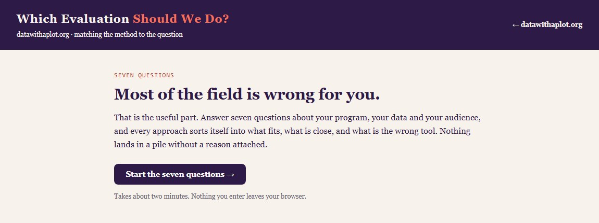
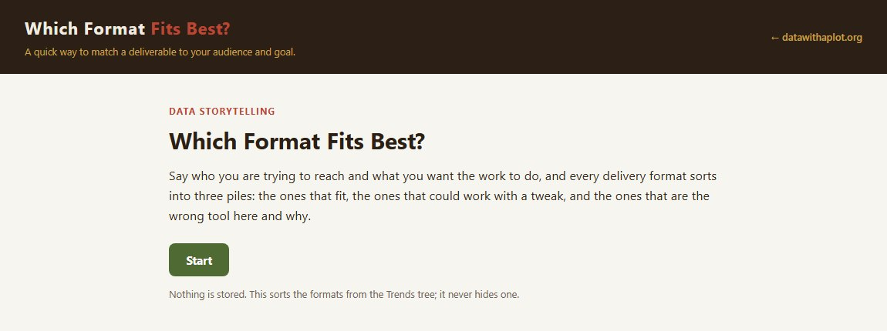

```{=html}
<div class="hero-section container">
  <div class="row align-items-center">
    <div class="col-md-9">
      <svg class="hero-logo" viewBox="0 0 470 110" xmlns="http://www.w3.org/2000/svg" role="img" aria-label="Data with a Plot · Lindsey E. Wylie, J.D., Ph.D.">
        <g transform="translate(5,5)">
          <g fill="none">
            <circle cx="18" cy="68" r="4" fill="#A98BB8"/>
            <circle cx="28" cy="84" r="4" fill="#A98BB8"/>
            <circle cx="32" cy="52" r="4" fill="#A98BB8"/>
            <circle cx="44" cy="26" r="4" fill="#A98BB8"/>
            <circle cx="52" cy="46" r="4" fill="#A98BB8"/>
            <circle cx="40" cy="42" r="4" fill="#B23A28"/>
            <path d="M10,80 C26,80 30,34 50,34 C58,34 58,42 62,46" stroke="#2E1A47" stroke-width="3.5" stroke-linecap="round"/>
            <g transform="translate(62,46) rotate(45)" stroke="#2E1A47" stroke-width="3" stroke-linecap="round" stroke-linejoin="round">
              <path d="M0,0 L-9,-20 Q0,-27 9,-20 Z"/>
              <line x1="0" y1="-4" x2="0" y2="-13"/>
              <circle cx="0" cy="-16.5" r="2.2"/>
              <rect x="-7.5" y="-44" width="15" height="22" rx="6"/>
            </g>
          </g>
        </g>
        <text x="120" y="72" font-family="Spectral,Georgia,serif" font-size="44" font-weight="600" fill="#2E1A47">Data <tspan font-style="italic" font-weight="400" fill="#B23A28">with a</tspan> Plot</text>
      </svg>
      <p class="hero-tagline">Lindsey E. Wylie, J.D., Ph.D.</p>
      <p class="hero-intro">
        Adult at 18. Senior at 65. High risk, moderate, or low. The law
        treats these bright lines like laws of nature. Every line misses the
        ones in between. I tell their stories with data.
      </p>
    </div>
  </div>
</div>
```

```{=html}
<div class="section-divider" aria-hidden="true">
  <svg viewBox="0 0 220 34" aria-hidden="true" focusable="false">
    <path d="M8,27 C48,27 70,7 110,7 C150,7 178,24 212,26" fill="none" stroke="#2E1A47" stroke-width="3" stroke-linecap="round"/>
    <circle cx="30" cy="22" r="3.2" fill="#A98BB8"/>
    <circle cx="66" cy="14" r="3.2" fill="#A98BB8"/>
    <circle cx="104" cy="12" r="3.2" fill="#A98BB8"/>
    <circle cx="142" cy="16" r="3.2" fill="#A98BB8"/>
    <circle cx="186" cy="27" r="3.2" fill="#A98BB8"/>
    <circle cx="122" cy="4" r="3.6" fill="#B23A28"/>
  </svg>
</div>
```

## The Premise {#about .section-heading data-eyebrow="01 · where this starts"}

```{=html}
<div class="bio-block">
  <span class="bio-avatar"></span>
  <div class="bio-body">
    <p>I study how the legal system measures people: how it decides who
    counts as an adult, who is high-risk, who is competent, and what follows
    when those measurement choices are treated as settled facts. Much of my
    work concerns the unintended consequences of well-intentioned rules, and
    the distance between what a policy is meant to do and what it does.</p>

    <div class="credential-badges">
      <span class="badge-item">Ph.D., Social Psychology · concentration in Research 
      Design &amp; Data Analysis</span>
      <span class="badge-item">J.D. · concentration in Health Law</span>
    </div>

    <p>My interests are shaped by my experience as a system-involved young
    person and my desire to highlight under-studied research topics.</p>

    <p>Before joining the National Center for State Courts, I directed
    research at the University of Nebraska Omaha's Juvenile Justice
    Institute. I have led federally funded research projects and multi-state
    evaluations across topics in pretrial and diversion, behavioral health in courts, 
    and family violence.</p>

    <p><a href="selected-work/">See the plot so far: publications and CV →</a></p>
  </div>
</div>
```

```{=html}
<div class="section-divider" aria-hidden="true">
  <svg viewBox="0 0 220 34" aria-hidden="true" focusable="false">
    <path d="M8,27 C48,27 70,7 110,7 C150,7 178,24 212,26" fill="none" stroke="#2E1A47" stroke-width="3" stroke-linecap="round"/>
    <circle cx="30" cy="22" r="3.2" fill="#A98BB8"/>
    <circle cx="66" cy="14" r="3.2" fill="#A98BB8"/>
    <circle cx="104" cy="12" r="3.2" fill="#A98BB8"/>
    <circle cx="142" cy="16" r="3.2" fill="#A98BB8"/>
    <circle cx="186" cy="27" r="3.2" fill="#A98BB8"/>
    <circle cx="122" cy="4" r="3.6" fill="#B23A28"/>
  </svg>
</div>
```

## Start Here {#featured .section-heading data-eyebrow="02 · featured work"}

```{=html}
<div class="project-grid">
  <div class="project-card">
    <a href="hiphop/hiphop_periodic_table.html" class="project-card-thumb" aria-hidden="true" tabindex="-1">
      
    </a>
    <span class="project-card-tag">Data Storytelling</span>
    <p class="project-card-title">A Periodic Table of Hip-Hop Artists</p>
    <p class="project-card-desc">
      A dataset built to teach measurement validity, sampling bias, uncertainty
      communication, and visualization design, using a subject people genuinely
      argue about.
    </p>
    <div class="project-card-meta">
      <span><span class="project-card-accent" style="background:#A98BB8;"></span>R / Quarto</span>
      <span><span class="project-card-accent" style="background:#F4715C;"></span>Interactive</span>
      <span><span class="project-card-accent" style="background:#2E1A47;"></span>Teaching module</span>
    </div>
    <br>
    <a href="hiphop/hiphop_periodic_table.html" style="font-weight:600; color:#B23A28;">
      Explore the periodic table →
    </a>
  </div>

  <div class="project-card">
    <a href="evalpicker/eval_picker.html" class="project-card-thumb" aria-hidden="true" tabindex="-1">
      
    </a>
    <span class="project-card-tag">Evaluation Practice</span>
    <p class="project-card-title">Which Evaluation Should We Do?</p>
    <p class="project-card-desc">
      Say what you have and what you want to know, and every evaluation approach
      lands in one of three piles: what fits, what is the wrong tool and why, and
      what is close, with the gap named and the work to close it spelled out.
    </p>
    <div class="project-card-meta">
      <span><span class="project-card-accent" style="background:#A98BB8;"></span>R / Quarto</span>
      <span><span class="project-card-accent" style="background:#2E1A47;"></span>Decision tool</span>
      <span><span class="project-card-accent" style="background:#F4715C;"></span>Interactive</span>
    </div>
    <br>
    <a href="evalpicker/eval_picker.html" style="font-weight:600; color:#B23A28;">
      Open the evaluation picker →
    </a>
  </div>

  <div class="project-card">
    <a href="countedwrong/index.html" class="project-card-thumb" aria-hidden="true" tabindex="-1">
      
    </a>
    <span class="project-card-tag">Data Storytelling</span>
    <p class="project-card-title">Maturity Gap: A Line at 18</p>
    <p class="project-card-desc">
      Young adults in the legal system, one chart at a time: federal arrest,
      prison, and recidivism numbers, then a study that measured the same
      1,354 people growing up, with a note under every figure on why that
      chart form got the job.
    </p>
    <div class="project-card-meta">
      <span><span class="project-card-accent" style="background:#A98BB8;"></span>R / Quarto</span>
      <span><span class="project-card-accent" style="background:#B23A28;"></span>Data story</span>
      <span><span class="project-card-accent" style="background:#2E1A47;"></span>Chart selection</span>
    </div>
    <br>
    <a href="countedwrong/index.html" style="font-weight:600; color:#B23A28;">
      Read the data story →
    </a>
  </div>

  <div class="project-card">
    <a href="formatpicker/format_picker.html" class="project-card-thumb" aria-hidden="true" tabindex="-1">
      
    </a>
    <span class="project-card-tag">Data Storytelling</span>
    <p class="project-card-title">Which Format Fits Best?</p>
    <p class="project-card-desc">
      Say who you are trying to reach and what you want the work to do, and every
      delivery format sorts into three piles: the ones that fit, the ones that
      could work with a tweak, and the ones that are the wrong tool here and why.
    </p>
    <div class="project-card-meta">
      <span><span class="project-card-accent" style="background:#A98BB8;"></span>R / Quarto</span>
      <span><span class="project-card-accent" style="background:#2E1A47;"></span>Decision tool</span>
      <span><span class="project-card-accent" style="background:#F4715C;"></span>Interactive</span>
    </div>
    <br>
    <a href="formatpicker/format_picker.html" style="font-weight:600; color:#B23A28;">
      Open the format picker →
    </a>
  </div>
</div>
```

```{=html}
<div class="section-divider" aria-hidden="true">
  <svg viewBox="0 0 220 34" aria-hidden="true" focusable="false">
    <path d="M8,27 C48,27 70,7 110,7 C150,7 178,24 212,26" fill="none" stroke="#2E1A47" stroke-width="3" stroke-linecap="round"/>
    <circle cx="30" cy="22" r="3.2" fill="#A98BB8"/>
    <circle cx="66" cy="14" r="3.2" fill="#A98BB8"/>
    <circle cx="104" cy="12" r="3.2" fill="#A98BB8"/>
    <circle cx="142" cy="16" r="3.2" fill="#A98BB8"/>
    <circle cx="186" cy="27" r="3.2" fill="#A98BB8"/>
    <circle cx="122" cy="4" r="3.6" fill="#B23A28"/>
  </svg>
</div>
```

## The Method {#whatIdo .section-heading data-eyebrow="03 · how i work"}

```{=html}
<div class="focus-grid">

  <div class="focus-card" style="--accent:#2E1A47;">
    <span class="focus-card-icon" aria-hidden="true">
      <svg viewBox="0 0 28 26">
        <path d="M4.5 22.5h19" stroke="currentColor" stroke-width="1.8" stroke-linecap="round" fill="none"/>
        <rect x="7" y="14" width="4" height="8.5" rx="1.2" fill="currentColor"/>
        <rect x="12.5" y="8.5" width="4" height="14" rx="1.2" fill="currentColor" opacity="0.55"/>
        <rect x="18" y="11.5" width="4" height="11" rx="1.2" fill="currentColor"/>
      </svg>
    </span>
    <div class="focus-card-body">
      <p class="focus-card-label">Applied Research Methods and Design</p>
      <p class="focus-card-text">
        Randomized studies and quasi-experimental methods across law, psychology,
        and public policy, with designs matched to the question and to the
        limits of real-world settings.
      </p>
    </div>
  </div>

  <div class="focus-card" style="--accent:#F4715C;">
    <span class="focus-card-icon" aria-hidden="true">
      <svg viewBox="0 0 28 26">
        <path d="M7.5 8.5h11" stroke="currentColor" stroke-width="1.8" stroke-linecap="round" fill="none"/>
        <circle cx="7.5" cy="8.5" r="2.4" fill="none" stroke="currentColor" stroke-width="1.8"/>
        <circle cx="18.5" cy="8.5" r="2.6" fill="currentColor"/>
        <path d="M7.5 17.5h7.5" stroke="currentColor" stroke-width="1.8" stroke-linecap="round" fill="none"/>
        <circle cx="7.5" cy="17.5" r="2.4" fill="none" stroke="currentColor" stroke-width="1.8"/>
        <circle cx="15" cy="17.5" r="2.6" fill="currentColor"/>
      </svg>
    </span>
    <div class="focus-card-body">
      <p class="focus-card-label">Tailored Program Evaluation and Recommendations</p>
      <p class="focus-card-text">
        Process and outcome evaluations of courts, diversion, and pretrial
        programs, combining numbers with interviews and observation to produce
        recommendations programs can act on.
      </p>
    </div>
  </div>

  <div class="focus-card" style="--accent:#A98BB8;">
    <span class="focus-card-icon" aria-hidden="true">
      <svg viewBox="0 0 28 26">
        <g stroke="currentColor" stroke-width="1.8" stroke-linecap="round" fill="none">
          <path d="M7 7v12M5 7h4M5 19h4"/>
          <path d="M14 4.5v10M12 4.5h4M12 14.5h4"/>
          <path d="M21 10.5v11M19 10.5h4M19 21.5h4"/>
        </g>
        <circle cx="7" cy="13" r="2.2" fill="currentColor"/>
        <circle cx="14" cy="9.5" r="2.2" fill="currentColor"/>
        <circle cx="21" cy="16" r="2.2" fill="currentColor"/>
      </svg>
    </span>
    <div class="focus-card-body">
      <p class="focus-card-label">Tests of Measurement Validity and Reliability</p>
      <p class="focus-card-text">
        Building and testing screening tools and rating scales: evidence that
        a tool measures what it claims to, consistently.
      </p>
    </div>
  </div>

  <div class="focus-card" style="--accent:#B23A28;">
    <span class="focus-card-icon" aria-hidden="true">
      <svg viewBox="0 0 28 26">
        <path d="M4 6a2.5 2.5 0 0 1 2.5-2.5h15A2.5 2.5 0 0 1 24 6v10a2.5 2.5 0 0 1-2.5 2.5H12l-5 4v-4H6.5A2.5 2.5 0 0 1 4 16z" fill="none" stroke="currentColor" stroke-width="1.8" stroke-linejoin="round"/>
        <path d="M8.5 13.5l3.5-3 2.8 1.6 4-4.5" fill="none" stroke="currentColor" stroke-width="1.8" stroke-linecap="round" stroke-linejoin="round"/>
        <circle cx="18.8" cy="7.6" r="1.9" fill="currentColor"/>
      </svg>
    </span>
    <div class="focus-card-body">
      <p class="focus-card-label">Practical Storytelling with Data</p>
      <p class="focus-card-text">
        Professional and graduate teaching that turns careful analysis into work a
        judge, funder, or community will read and remember, taught on datasets
        whose flaws are part of the lesson.
      </p>
    </div>
  </div>

</div>
```

```{=html}
<div class="section-divider" aria-hidden="true">
  <svg viewBox="0 0 220 34" aria-hidden="true" focusable="false">
    <path d="M8,27 C48,27 70,7 110,7 C150,7 178,24 212,26" fill="none" stroke="#2E1A47" stroke-width="3" stroke-linecap="round"/>
    <circle cx="30" cy="22" r="3.2" fill="#A98BB8"/>
    <circle cx="66" cy="14" r="3.2" fill="#A98BB8"/>
    <circle cx="104" cy="12" r="3.2" fill="#A98BB8"/>
    <circle cx="142" cy="16" r="3.2" fill="#A98BB8"/>
    <circle cx="186" cy="27" r="3.2" fill="#A98BB8"/>
    <circle cx="122" cy="4" r="3.6" fill="#B23A28"/>
  </svg>
</div>
```

::: {style="text-align: center; padding: 3rem 0 1rem; color: #6b7280; font-size: 0.9rem;"}
Built with [Quarto](https://quarto.org) · Hosted on [GitHub
Pages](https://pages.github.com)

<span style="display:block; margin-top:0.5rem; font-size:0.8rem; color:#9ca3af; font-style:italic;">n = 1 website. Results may not generalize.</span>
:::
