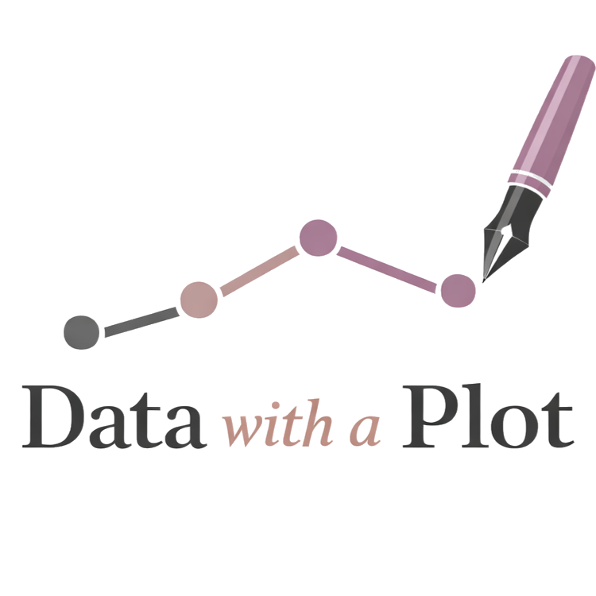

```{=html}
<div class="hero-section container">
  <div class="row align-items-center">
    <div class="col-md-9">
      
      <p class="hero-tagline">Lindsey E. Wylie, J.D., Ph.D.</p>
      <p class="hero-intro">
        Rigorous analytic thinking, made accessible — through unexpected
        datasets, practical methodology, and visualizations built to be
        understood and remembered.
      </p>
    </div>
  </div>
</div>
```

------------------------------------------------------------------------

## About {#about .section-heading}

```{=html}
<div class="bio-block">
  <span class="bio-avatar"></span>
  <div class="bio-body">
    <p>My work explores the intersection of law, data, and decision-making —
    with a throughline of measurement: how we decide to count people and
    outcomes, and what happens downstream when those choices get treated as
    facts.</p>

    <div class="credential-badges">
      <span class="badge-item">PhD, Social Psychology · certificate in Research Methods &amp; Data Analysis</span>
      <span class="badge-item">JD · concentration in Health Law</span>
      <span class="badge-item">Senior Research Associate · National Center for State Courts</span>
    </div>

    <p>I'm particularly interested in the unintended consequences of legal
    decisions and interventions — the places where a well-intentioned rule
    meets a complicated reality.</p>

    <a class="cv-download" href="CV/Wylie%20CV%208.2025.pdf" target="_blank" rel="noopener">
      <span class="cv-download-icon">↓</span> Download CV <span class="cv-download-ext">PDF</span>
    </a>
  </div>
</div>
```

------------------------------------------------------------------------

## What I Do {#whatIdo .section-heading}

```{=html}
<div class="focus-grid">

  <div class="focus-card" style="--accent:#8C6A8D;">
    <p class="focus-card-label">Applied Research</p>
    <p class="focus-card-text">
      Work across law, psychology, and public policy — with a standing interest
      in construct validity, uncertainty, and the politics of how metrics get
      built and used.
    </p>
  </div>

  <div class="focus-card" style="--accent:#E98973;">
    <p class="focus-card-label">Program Evaluation</p>
    <p class="focus-card-text">
      Process and outcome evaluations of courts, diversion, and pretrial
      programs — measuring whether an intervention performs as intended.
    </p>
  </div>

  <div class="focus-card" style="--accent:#6b4f6c;">
    <p class="focus-card-label">Measurement &amp; Design</p>
    <p class="focus-card-text">
      Building and validating screening tools and latent-trait measures, and the
      research designs that make a finding trustworthy in the first place.
    </p>
  </div>

  <div class="focus-card" style="--accent:#B5835A;">
    <p class="focus-card-label">Storytelling with Data</p>
    <p class="focus-card-text">
      Executive and graduate teaching that turns rigorous analysis into
      something a judge, funder, or community will read and remember —
      taught on datasets with documented flaws.
    </p>
  </div>

</div>
```

------------------------------------------------------------------------

## Featured Project {#featured .section-heading}

```{=html}
<div class="project-grid">
  <div class="project-card">
    <span class="project-card-tag">Data Storytelling</span>
    <p class="project-card-title">A Periodic Table of Hip-Hop Artists</p>
    <p class="project-card-desc">
      A dataset built to teach measurement validity, sampling bias, uncertainty
      communication, and visualization design — using a subject that provokes
      genuine debate.
    </p>
    <div class="project-card-meta">
      <span><span class="project-card-accent" style="background:#8C6A8D;"></span>R / Quarto</span>
      <span><span class="project-card-accent" style="background:#E98973;"></span>Interactive</span>
      <span><span class="project-card-accent" style="background:#D2B1A3;"></span>Teaching module</span>
    </div>
    <br>
    <a href="hiphop/hiphop_periodic_table.html" style="font-weight:600; color:#E98973;">
      Explore the periodic table →
    </a>
  </div>
</div>
```

------------------------------------------------------------------------

::: {style="text-align: center; padding: 3rem 0 1rem; color: #6b7280; font-size: 0.9rem;"}
Built with [Quarto](https://quarto.org) · Hosted on [GitHub
Pages](https://pages.github.com)
:::
