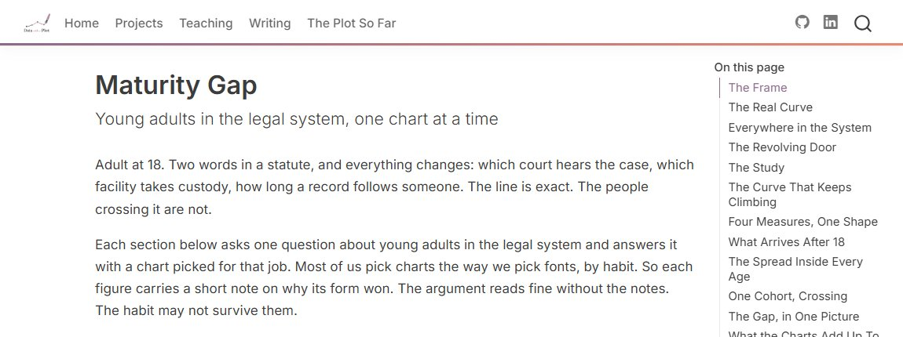

```{=html}
<div class="hero-section container">
  <div class="row align-items-center">
    <div class="col-md-9">
      <svg class="hero-logo" viewBox="0 0 470 110" xmlns="http://www.w3.org/2000/svg" role="img" aria-label="Data with a Plot · Lindsey E. Wylie, J.D., Ph.D.">
        <g transform="translate(5,5)">
          <g fill="none">
            <circle cx="18" cy="68" r="4" fill="#A98BB8"/>
            <circle cx="28" cy="84" r="4" fill="#A98BB8"/>
            <circle cx="32" cy="52" r="4" fill="#A98BB8"/>
            <circle cx="44" cy="26" r="4" fill="#A98BB8"/>
            <circle cx="52" cy="46" r="4" fill="#A98BB8"/>
            <circle cx="40" cy="42" r="4" fill="#B23A28"/>
            <path d="M10,80 C26,80 30,34 50,34 C58,34 58,42 62,46" stroke="#2E1A47" stroke-width="3.5" stroke-linecap="round"/>
            <g transform="translate(62,46) rotate(45)" stroke="#2E1A47" stroke-width="3" stroke-linecap="round" stroke-linejoin="round">
              <path d="M0,0 L-9,-20 Q0,-27 9,-20 Z"/>
              <line x1="0" y1="-4" x2="0" y2="-13"/>
              <circle cx="0" cy="-16.5" r="2.2"/>
              <rect x="-7.5" y="-44" width="15" height="22" rx="6"/>
            </g>
          </g>
        </g>
        <text x="120" y="72" font-family="Spectral,Georgia,serif" font-size="44" font-weight="600" fill="#2E1A47">Data <tspan font-style="italic" font-weight="400" fill="#B23A28">with a</tspan> Plot</text>
      </svg>
      <p class="hero-tagline">Lindsey E. Wylie, J.D., Ph.D.</p>
      <p class="hero-intro">
        Adult at 18. Senior at 65. High risk, moderate, or low. The law
        treats these bright lines like laws of nature. Every line misses the
        ones in between. I tell their stories with data.
      </p>
    </div>
  </div>
</div>
```

## The Premise {#about .section-heading data-eyebrow="01 · where this starts"}

```{=html}
<div class="bio-block">
  <span class="bio-avatar"></span>
  <div class="bio-body">
    <p>I study how the legal system measures people: how it decides who
    counts as an adult, who is high-risk, who is competent, and what follows
    when those measurement choices are treated as settled facts. Much of my
    work concerns the unintended consequences of well-intentioned rules, and
    the distance between what a policy is meant to do and what it does.</p>

    <div class="credential-badges">
      <span class="badge-item">Ph.D., Social Psychology · concentration in Research 
      Design &amp; Data Analysis</span>
      <span class="badge-item">J.D. · concentration in Health Law</span>
    </div>

    <p>My interests are shaped by my experience as a system-involved young
    person and my desire to highlight under-studied research topics.</p>

    <p>Before joining the National Center for State Courts, I directed
    research at the University of Nebraska Omaha's Juvenile Justice
    Institute. I have led federally funded research projects and multi-state
    evaluations across topics in pretrial and diversion, behavioral health in courts, 
    and family violence.</p>

    <p><a href="selected-work/">See the plot so far: publications and CV →</a></p>
  </div>
</div>
```

```{=html}
<div class="section-divider" aria-hidden="true">
  <svg viewBox="0 0 220 34" aria-hidden="true" focusable="false">
    <path d="M8,27 C48,27 70,7 110,7 C150,7 178,24 212,26" fill="none" stroke="#2E1A47" stroke-width="3" stroke-linecap="round"/>
    <circle cx="30" cy="22" r="3.2" fill="#A98BB8"/>
    <circle cx="66" cy="14" r="3.2" fill="#A98BB8"/>
    <circle cx="104" cy="12" r="3.2" fill="#A98BB8"/>
    <circle cx="142" cy="16" r="3.2" fill="#A98BB8"/>
    <circle cx="186" cy="27" r="3.2" fill="#A98BB8"/>
    <circle cx="122" cy="4" r="3.6" fill="#B23A28"/>
  </svg>
</div>
```

## Start Here {#featured .section-heading data-eyebrow="02 · featured work"}

```{=html}
<div class="project-grid">
  <div class="project-card">
    <a href="hiphop/hiphop_periodic_table.html" class="project-card-thumb" aria-hidden="true" tabindex="-1">
      
    </a>
    <span class="project-card-tag">Data Storytelling</span>
    <p class="project-card-title"><a href="hiphop/hiphop_periodic_table.html">A Periodic Table of Hip-Hop Artists</a></p>
    <p class="project-card-desc">
      A dataset built to teach measurement validity, sampling bias, uncertainty
      communication, and visualization design, using a subject people genuinely
      argue about.
    </p>
  </div>

  <div class="project-card">
    <a href="countedwrong/index.html" class="project-card-thumb" aria-hidden="true" tabindex="-1">
      
    </a>
    <span class="project-card-tag">Data Storytelling</span>
    <p class="project-card-title"><a href="countedwrong/index.html">Maturity Gap: A Line at 18</a></p>
    <p class="project-card-desc">
      Young adults in the legal system, one chart at a time: federal arrest,
      prison, and recidivism numbers, then a study that measured the same
      1,354 people growing up, with a note under every figure on why that
      chart form got the job.
    </p>
  </div>
</div>
```

::: {style="text-align: center; padding: 3rem 0 1rem; color: #6b7280; font-size: 0.9rem;"}
Built with [Quarto](https://quarto.org) · Hosted on [GitHub
Pages](https://pages.github.com)

<span style="display:block; margin-top:0.5rem; font-size:0.8rem; color:#9ca3af; font-style:italic;">n = 1 website. Results may not generalize.</span>
:::
