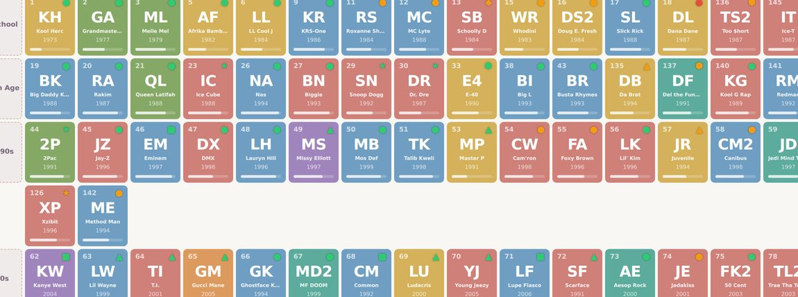
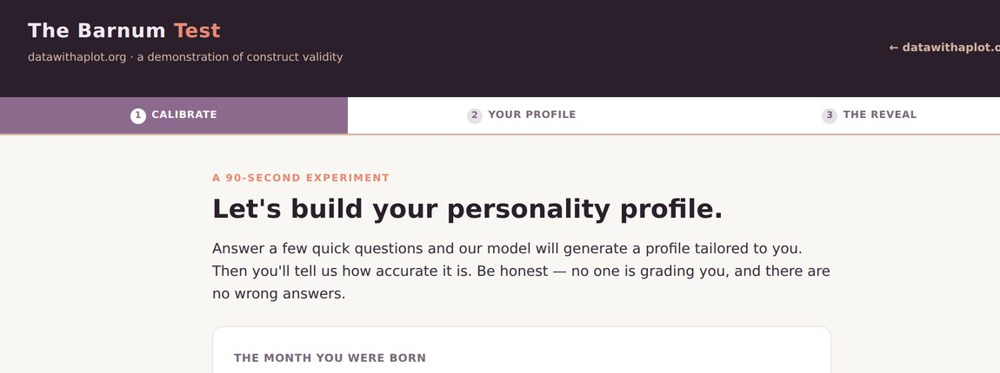

```{=html}
<div class="hero-section container">
  <div class="hero-row">
    <div class="hero-text">
      
      <p class="hero-tagline">Lindsey E. Wylie, J.D., Ph.D.</p>
      <p class="hero-intro">
        Rigorous analytic thinking, made accessible — through unexpected
        datasets, practical methodology, and visualizations built to be
        understood and remembered.
      </p>
    </div>
    <div class="hero-motif-col">
      <svg class="hero-motif" viewBox="0 0 300 170" aria-hidden="true" focusable="false">
        <defs>
          <linearGradient id="motif-line" x1="0" y1="0" x2="1" y2="0">
            <stop offset="0" stop-color="#8C6A8D"/>
            <stop offset="1" stop-color="#E98973"/>
          </linearGradient>
        </defs>
        <g stroke="#d8cfd4" stroke-width="1.5" stroke-linecap="round">
          <path d="M 18 10 V 152"/>
          <path d="M 18 152 H 292"/>
        </g>
        <path d="M 34 132 C 100 128, 170 96, 278 32" fill="none" stroke="url(#motif-line)" stroke-width="2.5" stroke-linecap="round"/>
        <circle cx="52" cy="122" r="5" fill="#8C6A8D"/>
        <circle cx="94" cy="134" r="5" fill="#9d7397"/>
        <circle cx="138" cy="104" r="5" fill="#b07d90"/>
        <circle cx="182" cy="112" r="5" fill="#c48389"/>
        <circle cx="224" cy="66" r="5" fill="#d78681"/>
        <circle cx="266" cy="42" r="5" fill="#E98973"/>
      </svg>
    </div>
  </div>
</div>
```

------------------------------------------------------------------------

## What I Do {#about .section-heading}

```{=html}
<div class="bio-block">
  <span class="bio-avatar"></span>
  <div class="bio-body">
    <p>I study how data informs decision-making and legal policies--with specific
    attention to how measurement influences outcomes</p>

    <div class="credential-badges">
      <span class="badge-item">Ph.D., Social Psychology · concentration in Research 
      Design &amp; Data Analysis</span>
      <span class="badge-item">J.D. · concentration in Health Law</span>
    </div>

    <p>I am especially interested in the unintended consequences of legal
    decisions and interventions, which are often found at the intersection of 
    well-intentioned law or policy, and the reality of complex systems. My interests 
    are shaped by my experience as a system-involved young person and my desire to 
    highlight under-studied research topics.</p>

    <p>Before joining the National Center for State Courts, I directed
    research at the University of Nebraska Omaha's Juvenile Justice
    Institute. I have led federally funded research projects and multi-state
    evaluations across topics in pretrial and diversion, behavioral health in courts, 
    and family violence.</p>

    <p><a href="selected-work/">See selected work &amp; CV →</a></p>
  </div>
</div>
```

------------------------------------------------------------------------

## How I Do It {#whatIdo .section-heading}

```{=html}
<div class="focus-grid">

  <div class="focus-card" style="--accent:#8C6A8D;">
    <span class="focus-card-icon" aria-hidden="true">
      <svg viewBox="0 0 28 26">
        <path d="M4.5 22.5h19" stroke="currentColor" stroke-width="1.8" stroke-linecap="round" fill="none"/>
        <rect x="7" y="14" width="4" height="8.5" rx="1.2" fill="currentColor"/>
        <rect x="12.5" y="8.5" width="4" height="14" rx="1.2" fill="currentColor" opacity="0.55"/>
        <rect x="18" y="11.5" width="4" height="11" rx="1.2" fill="currentColor"/>
      </svg>
    </span>
    <div class="focus-card-body">
      <p class="focus-card-label">Applied Research Methods and Design</p>
      <p class="focus-card-text">
        Randomized studies and quasi-experimental methods across law, psychology,
        and public policy — designs matched to the question and to the
        constraints of real-world settings.
      </p>
    </div>
  </div>

  <div class="focus-card" style="--accent:#E98973;">
    <span class="focus-card-icon" aria-hidden="true">
      <svg viewBox="0 0 28 26">
        <path d="M7.5 8.5h11" stroke="currentColor" stroke-width="1.8" stroke-linecap="round" fill="none"/>
        <circle cx="7.5" cy="8.5" r="2.4" fill="none" stroke="currentColor" stroke-width="1.8"/>
        <circle cx="18.5" cy="8.5" r="2.6" fill="currentColor"/>
        <path d="M7.5 17.5h7.5" stroke="currentColor" stroke-width="1.8" stroke-linecap="round" fill="none"/>
        <circle cx="7.5" cy="17.5" r="2.4" fill="none" stroke="currentColor" stroke-width="1.8"/>
        <circle cx="15" cy="17.5" r="2.6" fill="currentColor"/>
      </svg>
    </span>
    <div class="focus-card-body">
      <p class="focus-card-label">Tailored Program Evaluation and Recommendations</p>
      <p class="focus-card-text">
        Process and outcome evaluations of courts, diversion, and pretrial
        programs — combining quantitative and qualitative methods to produce
        recommendations programs can act on.
      </p>
    </div>
  </div>

  <div class="focus-card" style="--accent:#6b4f6c;">
    <span class="focus-card-icon" aria-hidden="true">
      <svg viewBox="0 0 28 26">
        <g stroke="currentColor" stroke-width="1.8" stroke-linecap="round" fill="none">
          <path d="M7 7v12M5 7h4M5 19h4"/>
          <path d="M14 4.5v10M12 4.5h4M12 14.5h4"/>
          <path d="M21 10.5v11M19 10.5h4M19 21.5h4"/>
        </g>
        <circle cx="7" cy="13" r="2.2" fill="currentColor"/>
        <circle cx="14" cy="9.5" r="2.2" fill="currentColor"/>
        <circle cx="21" cy="16" r="2.2" fill="currentColor"/>
      </svg>
    </span>
    <div class="focus-card-body">
      <p class="focus-card-label">Tests of Measurement Validity and Reliability</p>
      <p class="focus-card-text">
        Building and validating screening tools and latent-trait measures —
        evidence that an instrument measures what it claims to, consistently.
      </p>
    </div>
  </div>

  <div class="focus-card" style="--accent:#B5835A;">
    <span class="focus-card-icon" aria-hidden="true">
      <svg viewBox="0 0 28 26">
        <path d="M4 6a2.5 2.5 0 0 1 2.5-2.5h15A2.5 2.5 0 0 1 24 6v10a2.5 2.5 0 0 1-2.5 2.5H12l-5 4v-4H6.5A2.5 2.5 0 0 1 4 16z" fill="none" stroke="currentColor" stroke-width="1.8" stroke-linejoin="round"/>
        <path d="M8.5 13.5l3.5-3 2.8 1.6 4-4.5" fill="none" stroke="currentColor" stroke-width="1.8" stroke-linecap="round" stroke-linejoin="round"/>
        <circle cx="18.8" cy="7.6" r="1.9" fill="currentColor"/>
      </svg>
    </span>
    <div class="focus-card-body">
      <p class="focus-card-label">Practical Storytelling with Data</p>
      <p class="focus-card-text">
        Executive and graduate teaching that turns rigorous analysis into work a
        judge, funder, or community will read and remember — taught on datasets
        whose flaws are part of the lesson.
      </p>
    </div>
  </div>

</div>
```

------------------------------------------------------------------------

## Featured Projects {#featured .section-heading}

```{=html}
<div class="project-grid">
  <div class="project-card">
    <a href="hiphop/hiphop_periodic_table.html" class="project-card-thumb" aria-hidden="true" tabindex="-1">
      
    </a>
    <span class="project-card-tag">Data Storytelling</span>
    <p class="project-card-title">A Periodic Table of Hip-Hop Artists</p>
    <p class="project-card-desc">
      A dataset built to teach measurement validity, sampling bias, uncertainty
      communication, and visualization design — using a subject that provokes
      genuine debate.
    </p>
    <div class="project-card-meta">
      <span><span class="project-card-accent" style="background:#8C6A8D;"></span>R / Quarto</span>
      <span><span class="project-card-accent" style="background:#E98973;"></span>Interactive</span>
      <span><span class="project-card-accent" style="background:#D2B1A3;"></span>Teaching module</span>
    </div>
    <br>
    <a href="hiphop/hiphop_periodic_table.html" style="font-weight:600; color:#E98973;">
      Explore the periodic table →
    </a>
  </div>

  <div class="project-card">
    <a href="barnum/barnum_test.html" class="project-card-thumb" aria-hidden="true" tabindex="-1">
      
    </a>
    <span class="project-card-tag">Data Storytelling</span>
    <p class="project-card-title">The Barnum Test</p>
    <p class="project-card-desc">
      A 90-second interactive exercise that builds a "personalized" profile,
      asks how accurate it feels, then reveals that every participant receives
      the identical text. A clear, memorable lesson in construct validity.
    </p>
    <div class="project-card-meta">
      <span><span class="project-card-accent" style="background:#8C6A8D;"></span>R / Quarto</span>
      <span><span class="project-card-accent" style="background:#6b4f6c;"></span>Construct validity</span>
      <span><span class="project-card-accent" style="background:#E98973;"></span>Interactive</span>
    </div>
    <br>
    <a href="barnum/barnum_test.html" style="font-weight:600; color:#8C6A8D;">
      Take the Barnum Test →
    </a>
  </div>
</div>
```

------------------------------------------------------------------------

::: {style="text-align: center; padding: 3rem 0 1rem; color: #6b7280; font-size: 0.9rem;"}
Built with [Quarto](https://quarto.org) · Hosted on [GitHub
Pages](https://pages.github.com)

<span style="display:block; margin-top:0.5rem; font-size:0.8rem; color:#9ca3af; font-style:italic;">n = 1 website. Results may not generalize.</span>
:::
