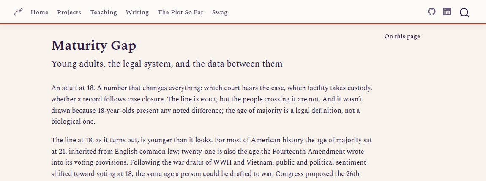
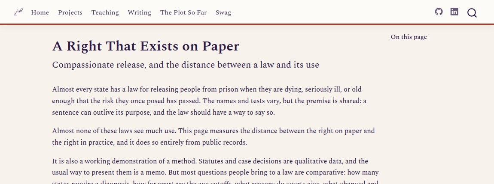

```{=html}
<div class="page-header container">
  <p class="page-header-label">Work</p>
  <h1 class="page-header-title">Projects</h1>
  <p class="page-header-sub">
    Applied research and documented datasets, each built around a real
    measurement question; the exercises and planning tools live on the
    <a href="../teaching/">Teaching page</a>.
  </p>
</div>

<div class="container">
  <h2 class="section-heading" id="the-work" data-eyebrow="01 · projects" style="margin-top: 2.5rem;">The Work</h2>
</div>

<div class="project-grid container">

  <div class="project-card">
    <a href="../hiphop/hiphop_periodic_table.html" class="project-card-thumb" aria-hidden="true" tabindex="-1">
      
    </a>
    <span class="project-card-tag">Data Storytelling · Teaching Module</span>
    <p class="project-card-title">The Hip-Hop Periodic Table</p>
    <p class="project-card-desc">
      A fully documented dataset of 187 hip-hop acts (143 solo artists and 44
      groups), each scored on five parts of lyricism, with confidence ratings
      for every act and a published data dictionary. Built to teach what goes into
      a score and what can quietly bend it, using a subject people genuinely
      argue about.
    </p>
    <div class="project-card-meta">
      <span><span class="project-card-accent" style="background:#6A5F72;"></span>Interactive</span>
      <span><span class="project-card-accent" style="background:#2E1A47;"></span>Measurement</span>
    </div>
    <a href="../hiphop/hiphop_periodic_table.html" class="project-card-cta">
      Explore the periodic table →
    </a>
  </div>

  <div class="project-card">
    <a href="../countedwrong/index.html" class="project-card-thumb" aria-hidden="true" tabindex="-1">
      
    </a>
    <span class="project-card-tag">Applied Research · Criminal Justice</span>
    <p class="project-card-title">Maturity Gap: A Line at 18</p>
    <p class="project-card-desc">
      Federal arrest, prison, and recidivism numbers on young adults, then
      Pathways to Desistance, which followed 1,354 young people for seven
      years after a serious offense. The law draws a bright line at 18, but
      development does not, and each chart uses the form best suited to
      showing that.
    </p>
    <div class="project-card-meta">
      <span><span class="project-card-accent" style="background:#F4715C;"></span>Longitudinal data</span>
      <span><span class="project-card-accent" style="background:#2E1A47;"></span>Developmental measurement</span>
      <span><span class="project-card-accent" style="background:#6A5F72;"></span>Law and policy</span>
    </div>
    <a href="../countedwrong/index.html" class="project-card-cta">
      Read the data story →
    </a>
  </div>

  <div class="project-card">
    <a href="../compassionaterelease/index.html" class="project-card-thumb" aria-hidden="true" tabindex="-1">
      
    </a>
    <span class="project-card-tag">Applied Research · Aging and the Law</span>
    <p class="project-card-title">A Right That Exists on Paper: Compassionate Release</p>
    <p class="project-card-desc">
      Nearly every state and the federal system has a compassionate or medical
      release law, and almost none of them see much use. This data story
      measures that gap from public records, reading federal sentencing data,
      fifty-state policy research, and one state's statutes as qualitative
      data that can be counted.
    </p>
    <div class="project-card-meta">
      <span><span class="project-card-accent" style="background:#F4715C;"></span>Statutory review</span>
      <span><span class="project-card-accent" style="background:#2E1A47;"></span>Aging and corrections</span>
      <span><span class="project-card-accent" style="background:#6A5F72;"></span>Law and policy</span>
    </div>
    <a href="../compassionaterelease/index.html" class="project-card-cta">
      Read the data story →
    </a>
  </div>

</div>

<p style="text-align: center; padding: 1rem 0 0; color: #6A5F72; font-size: 0.9rem;">
Work in progress is listed on the <a href="../writing/index.html#in-the-works">Writing page</a>.
</p>

<div class="container">
  <h2 class="section-heading" id="the-method" data-eyebrow="02 · how I work" style="margin-top: 2.5rem;">The Method</h2>
  <div class="focus-grid">

    <div class="focus-card" style="--accent:#2E1A47;">
      <span class="focus-card-icon" aria-hidden="true">
        <svg viewBox="0 0 28 26">
          <path d="M4.5 22.5h19" stroke="currentColor" stroke-width="1.8" stroke-linecap="round" fill="none"/>
          <rect x="7" y="14" width="4" height="8.5" rx="1.2" fill="currentColor"/>
          <rect x="12.5" y="8.5" width="4" height="14" rx="1.2" fill="currentColor" opacity="0.55"/>
          <rect x="18" y="11.5" width="4" height="11" rx="1.2" fill="currentColor"/>
        </svg>
      </span>
      <div class="focus-card-body">
        <p class="focus-card-label">Applied Research Methods and Design</p>
        <p class="focus-card-text">Randomized and quasi-experimental designs across law, psychology, and public policy, matched to the question and to real-world limits.</p>
      </div>
    </div>

    <div class="focus-card" style="--accent:#F4715C;">
      <span class="focus-card-icon" aria-hidden="true">
        <svg viewBox="0 0 28 26">
          <path d="M7.5 8.5h11" stroke="currentColor" stroke-width="1.8" stroke-linecap="round" fill="none"/>
          <circle cx="7.5" cy="8.5" r="2.4" fill="none" stroke="currentColor" stroke-width="1.8"/>
          <circle cx="18.5" cy="8.5" r="2.6" fill="currentColor"/>
          <path d="M7.5 17.5h7.5" stroke="currentColor" stroke-width="1.8" stroke-linecap="round" fill="none"/>
          <circle cx="7.5" cy="17.5" r="2.4" fill="none" stroke="currentColor" stroke-width="1.8"/>
          <circle cx="15" cy="17.5" r="2.6" fill="currentColor"/>
        </svg>
      </span>
      <div class="focus-card-body">
        <p class="focus-card-label">Tailored Program Evaluation and Recommendations</p>
        <p class="focus-card-text">Process and outcome evaluations of courts, diversion, and pretrial programs, with recommendations they can act on.</p>
      </div>
    </div>

    <div class="focus-card" style="--accent:#A98BB8;">
      <span class="focus-card-icon" aria-hidden="true">
        <svg viewBox="0 0 28 26">
          <g stroke="currentColor" stroke-width="1.8" stroke-linecap="round" fill="none">
            <path d="M7 7v12M5 7h4M5 19h4"/>
            <path d="M14 4.5v10M12 4.5h4M12 14.5h4"/>
            <path d="M21 10.5v11M19 10.5h4M19 21.5h4"/>
          </g>
          <circle cx="7" cy="13" r="2.2" fill="currentColor"/>
          <circle cx="14" cy="9.5" r="2.2" fill="currentColor"/>
          <circle cx="21" cy="16" r="2.2" fill="currentColor"/>
        </svg>
      </span>
      <div class="focus-card-body">
        <p class="focus-card-label">Tests of Measurement Validity and Reliability</p>
        <p class="focus-card-text">Screening tools and rating scales, tested for whether they measure what they claim to, consistently.</p>
      </div>
    </div>

    <div class="focus-card" style="--accent:#B23A28;">
      <span class="focus-card-icon" aria-hidden="true">
        <svg viewBox="0 0 28 26">
          <path d="M4 6a2.5 2.5 0 0 1 2.5-2.5h15A2.5 2.5 0 0 1 24 6v10a2.5 2.5 0 0 1-2.5 2.5H12l-5 4v-4H6.5A2.5 2.5 0 0 1 4 16z" fill="none" stroke="currentColor" stroke-width="1.8" stroke-linejoin="round"/>
          <path d="M8.5 13.5l3.5-3 2.8 1.6 4-4.5" fill="none" stroke="currentColor" stroke-width="1.8" stroke-linecap="round" stroke-linejoin="round"/>
          <circle cx="18.8" cy="7.6" r="1.9" fill="currentColor"/>
        </svg>
      </span>
      <div class="focus-card-body">
        <p class="focus-card-label">Practical Storytelling with Data</p>
        <p class="focus-card-text">Teaching that turns careful analysis into work a judge, funder, or community will read and remember.</p>
      </div>
    </div>

  </div>
</div>

```
