```{=html}
<style>
/* ---- Swag page (page-scoped; shared card classes come from site-theme.scss) ---- */
.swag-header{position:relative}
.swag-host{position:absolute;top:3.5rem;right:0;width:150px;text-align:center}
.swag-host-slot{width:134px;height:134px;border-radius:50%;overflow:hidden;margin:0 auto .5rem;border:3px solid #F4715C;box-shadow:0 6px 18px rgba(46,26,71,.16);background:#FDFBF7}
.swag-host-slot img{width:100%;height:100%;object-fit:cover;display:block;transform:scale(1.5);transform-origin:50% 18%}
.swag-host-cap{font-family:var(--bs-font-monospace,'JetBrains Mono',monospace);font-size:.6rem;letter-spacing:.1em;text-transform:uppercase;color:#6A5F72;line-height:1.4}
@media (max-width:640px){.swag-host{position:static;width:auto;margin:1.2rem 0 0}}

.swag-eyebrow{font-family:var(--bs-font-monospace,'JetBrains Mono',monospace);font-size:.72rem;font-weight:500;letter-spacing:.12em;text-transform:uppercase;color:#B23A28;margin:0 0 .4rem}
.swag-h2{font-size:1.7rem;font-weight:600;color:#2E1A47;margin:0 0 .5rem}
.swag-lead{font-size:1rem;color:#574B62;max-width:640px;line-height:1.6;margin:0 0 .4rem}
.swag-act{margin:2.4rem 0}

/* real subsection heading (was a styled <p>; now an <h3> so it lands in the outline) */
.swag-subhead{font-family:var(--bs-font-monospace,'JetBrains Mono',monospace);font-size:.72rem;font-weight:500;letter-spacing:.12em;text-transform:uppercase;color:#B23A28;margin:2.4rem 0 .3rem}
.swag-subhead:first-of-type{margin-top:.6rem}
.swag-subnote{font-size:.85rem;color:#6A5F72;max-width:640px;line-height:1.55;margin:0 0 1rem}

/* sticker gallery: the tile IS the download, so no per-card chrome */
.swag-gallery{display:grid;grid-template-columns:repeat(auto-fill,minmax(min(150px,100%),1fr));gap:1rem;margin:1rem 0 1rem}
.swag-gallery a{display:block;border:1px solid #E7DED0;border-radius:10px;background:#F7F2EC;padding:.75rem;text-align:center;text-decoration:none;transition:box-shadow .2s ease,transform .2s ease}
.swag-gallery a:hover,.swag-gallery a:focus-visible{box-shadow:0 4px 16px rgba(46,26,71,.10);transform:translateY(-2px);outline:none}
.swag-gallery img{width:100%;height:118px;object-fit:contain;display:block;margin-bottom:.55rem}
.swag-gallery .cap{font-family:var(--bs-font-monospace,'JetBrains Mono',monospace);font-size:.62rem;letter-spacing:.08em;text-transform:uppercase;color:#6A5F72;line-height:1.3}

/* preview well: whole design shown (contain), not cropped like a thumb */
.swag-art{display:grid;place-items:center;margin:-1.75rem -1.5rem 1.1rem;aspect-ratio:3/2;
  background:#F7F2EC;border-radius:10px 10px 0 0;border-bottom:1px solid #E7DED0;overflow:hidden;padding:1rem}
.swag-art--dark{background:#2E1A47}
.swag-art svg,.swag-art img{max-width:100%;max-height:100%;width:auto;height:auto;object-fit:contain;display:block}
.swag-cap{font-family:'Spectral',Georgia,serif;fill:#2E1A47;font-weight:600}
.swag-sub{font-family:var(--bs-font-monospace,'JetBrains Mono',monospace);fill:#6A5F72;font-weight:500;letter-spacing:.14em}
.swag-svg text{dominant-baseline:middle}

.swag-divider{display:flex;align-items:center;gap:1.5rem;margin:3.2rem 0 2.6rem}
.swag-divider .r{flex:1;height:1px;background:#E5DCCF}
</style>

<div class="page-header container swag-header">
  <p class="page-header-label">Downloads · No Store</p>
  <h1 class="page-header-title">Swag</h1>
  <p class="page-header-sub">The arc, the scatter, and the one dot the line misses, put on things. Stickers and wallpapers download as real files; the shirts and the rest are mockups, statistically insignificant as merch but the art is yours to keep.</p>
  <div class="swag-host">
    <div class="swag-host-slot">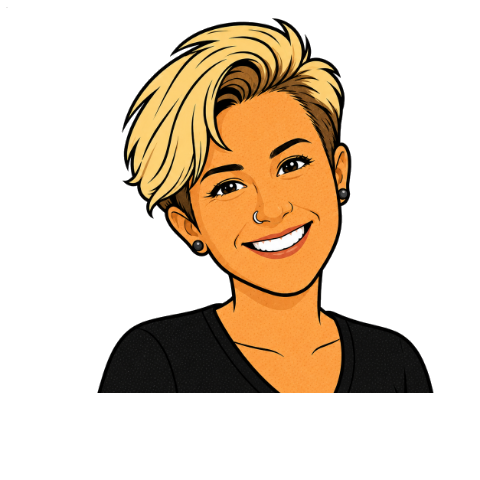</div>
    <div class="swag-host-cap">Your host</div>
  </div>
</div>

<div class="container">

<section class="swag-act">
  <p class="swag-eyebrow">01 · Grab and Go</p>
  <h2 class="swag-h2">Downloads</h2>
  <p class="swag-lead">Stickers, wallpapers, and the shirt art, yours to take. Every design in this section hands you a real file.</p>

  <h3 class="swag-subhead">Character Stickers</h3>
  <p class="swag-subnote">Click any sticker to download the transparent PNG, or take the whole sheet at once.</p>
  <div class="swag-gallery">
    <a href="pics/sticker-data-plot.png" download>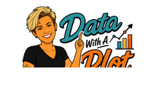<span class="cap">Data With a Plot</span></a>
    <a href="pics/sticker-you-got-this.png" download>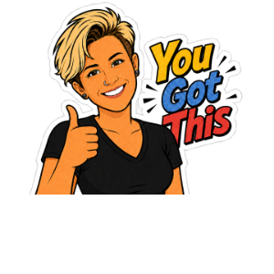<span class="cap">You Got This</span></a>
    <a href="pics/sticker-plot-twist.png" download>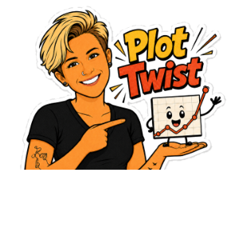<span class="cap">Plot Twist</span></a>
    <a href="pics/sticker-good-idea.png" download>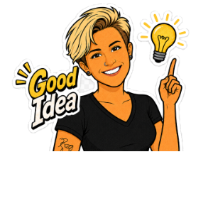<span class="cap">Good Idea</span></a>
    <a href="pics/sticker-coffee-fuel.png" download>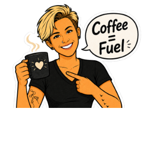<span class="cap">Coffee = Fuel</span></a>
    <a href="pics/sticker-thinking.png" download>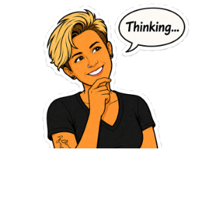<span class="cap">Thinking…</span></a>
  </div>
  <p class="source-chips" style="margin:0 0 .4rem"><a class="chip-link" href="downloads/sticker-sheet.png" download>Download the whole sticker sheet (PNG)</a></p>

  <h3 class="swag-subhead">Wallpapers</h3>
  <div class="project-grid">

    <div class="project-card">
      <span class="swag-art"></span>
      <span class="project-card-tag">Wallpaper · Download</span>
      <p class="project-card-title">Phone Wallpaper</p>
      <p class="project-card-desc">The arc climbing an ink-plum screen, with one coral outlier near the top.</p>
      <p class="source-chips"><a class="chip-link" href="downloads/wallpaper-phone-1170x2532.png" download>Phone · 1170 × 2532</a></p>
    </div>

    <div class="project-card">
      <span class="swag-art"></span>
      <span class="project-card-tag">Wallpaper · Download</span>
      <p class="project-card-title">Desktop Wallpaper</p>
      <p class="project-card-desc">The same rise and fall, wide, with room for your icons in the quiet corners.</p>
      <p class="source-chips"><a class="chip-link" href="downloads/wallpaper-desktop-1920x1080.png" download>Desktop · 1920 × 1080</a></p>
    </div>

  </div>

  <h3 class="swag-subhead">Shirt Art</h3>
  <p class="swag-subnote">Six flat print designs. The tees and hoodie are mockups, but the art downloads as one pack.</p>
  <p class="source-chips" style="margin:0 0 1.1rem"><a class="chip-link" href="downloads/shirt-designs.png" download>Download all six shirt designs (PNG)</a></p>
  <div class="project-grid">

    <div class="project-card">
      <span class="swag-art swag-svg"><svg viewBox="0 0 300 250" fill="none">
        <path d="M40,150 C90,150 108,82 150,78 C198,74 214,120 260,148" stroke="#2E1A47" stroke-width="5" stroke-linecap="round"/>
        <g fill="#A98BB8"><circle cx="66" cy="146" r="6"/><circle cx="102" cy="112" r="6"/><circle cx="150" cy="78" r="6"/><circle cx="196" cy="104" r="6"/><circle cx="236" cy="128" r="6"/></g>
        <line x1="130" y1="66" x2="130" y2="160" stroke="#B23A28" stroke-width="4" stroke-linecap="round"/>
        <circle cx="172" cy="58" r="8" fill="#F4715C"/>
        <text class="swag-sub" x="130" y="174" font-size="12" text-anchor="middle">AGE 18</text>
        <text class="swag-cap" x="150" y="206" font-size="27" text-anchor="middle">The Line at 18</text>
        <text class="swag-sub" x="150" y="230" font-size="11" text-anchor="middle">DATA WITH A PLOT</text>
      </svg></span>
      <span class="project-card-tag">Tee · Print Art</span>
      <p class="project-card-title">The Line at 18</p>
      <p class="project-card-desc">The maturity curve, the bright line at 18, and the one point sitting just past it.</p>
    </div>

    <div class="project-card">
      <span class="swag-art swag-svg"><svg viewBox="0 0 300 250" fill="none">
        <path d="M46,120 C86,120 100,84 150,84 C196,84 206,104 258,98" stroke="#2E1A47" stroke-width="5" stroke-linecap="round"/>
        <g fill="#A98BB8"><circle cx="64" cy="118" r="6"/><circle cx="102" cy="94" r="6"/><circle cx="150" cy="84" r="6"/><circle cx="196" cy="92" r="6"/><circle cx="234" cy="98" r="6"/></g>
        <circle cx="176" cy="52" r="8" fill="#F4715C"/>
        <text class="swag-cap" x="150" y="162" font-size="25" text-anchor="middle">I Tell Their Stories</text>
        <text class="swag-cap" x="150" y="192" font-size="25" text-anchor="middle">With Data</text>
        <text class="swag-sub" x="150" y="222" font-size="11" text-anchor="middle">DATA WITH A PLOT</text>
      </svg></span>
      <span class="project-card-tag">Tee · Print Art</span>
      <p class="project-card-title">I Tell Their Stories With Data</p>
      <p class="project-card-desc">Your tagline from the site's own social card, under the arc and the one it misses.</p>
    </div>

    <div class="project-card">
      <span class="swag-art swag-svg"><svg viewBox="0 0 300 250" fill="none">
        <text class="swag-cap" x="150" y="96" font-size="44" text-anchor="middle">Clarity Is</text>
        <text class="swag-cap" x="150" y="146" font-size="44" text-anchor="middle">Kindness</text>
        <path d="M78,180 C116,170 176,170 214,180" stroke="#B23A28" stroke-width="4" stroke-linecap="round"/>
        <circle cx="224" cy="178" r="6.5" fill="#F4715C"/>
        <text class="swag-sub" x="150" y="214" font-size="11" text-anchor="middle">DATA WITH A PLOT</text>
      </svg></span>
      <span class="project-card-tag">Tee · Print Art</span>
      <p class="project-card-title">Clarity Is Kindness</p>
      <p class="project-card-desc">Your working premise, set plain. The one that reads from across a room.</p>
    </div>

    <div class="project-card">
      <span class="swag-art swag-art--dark swag-svg"><svg viewBox="0 0 300 250" fill="none">
        <g transform="translate(150,86) scale(1.4) translate(-50,-50)">
          <circle cx="18" cy="68" r="4" fill="#A98BB8"/><circle cx="28" cy="84" r="4" fill="#A98BB8"/><circle cx="32" cy="52" r="4" fill="#A98BB8"/><circle cx="44" cy="26" r="4" fill="#A98BB8"/><circle cx="52" cy="46" r="4" fill="#A98BB8"/><circle cx="40" cy="42" r="4" fill="#F4715C"/>
          <path d="M10,80 C26,80 30,34 50,34 C58,34 58,42 62,46" stroke="#F7F2EC" stroke-width="3.5" stroke-linecap="round"/>
          <g transform="translate(62,46) rotate(45)" stroke="#F7F2EC" stroke-width="3" fill="none" stroke-linecap="round" stroke-linejoin="round"><path d="M0,0 L-9,-20 Q0,-27 9,-20 Z"/><line x1="0" y1="-4" x2="0" y2="-13"/><circle cx="0" cy="-16.5" r="2.2"/><rect x="-7.5" y="-44" width="15" height="22" rx="6"/></g>
        </g>
        <text x="150" y="200" font-size="30" font-weight="600" fill="#F7F2EC" font-family="Spectral,Georgia,serif" text-anchor="middle">Data <tspan font-style="italic" font-weight="400" fill="#F4715C">with a</tspan> Plot</text>
      </svg></span>
      <span class="project-card-tag">Hoodie · Print Art</span>
      <p class="project-card-title">The Wordmark</p>
      <p class="project-card-desc">The mark and the wordmark, cream on ink. The one a slogan-averse colleague will actually wear.</p>
    </div>

    <div class="project-card">
      <span class="swag-art swag-svg"><svg viewBox="0 0 300 250" fill="none">
        <g fill="#A98BB8"><circle cx="96" cy="128" r="6"/><circle cx="132" cy="140" r="6"/><circle cx="174" cy="126" r="6"/><circle cx="200" cy="144" r="6"/></g>
        <circle cx="166" cy="74" r="15" fill="#F4715C"/>
        <circle cx="166" cy="74" r="24" fill="none" stroke="#F4715C" stroke-width="2" opacity=".45"/>
        <text class="swag-cap" x="150" y="176" font-size="24" text-anchor="middle">Small Sample,</text>
        <text class="swag-cap" x="150" y="204" font-size="24" text-anchor="middle">Significant Effect</text>
        <text class="swag-sub" x="150" y="230" font-size="11" text-anchor="middle">DATA WITH A PLOT</text>
      </svg></span>
      <span class="project-card-tag">Tee · Print Art</span>
      <p class="project-card-title">Small Sample, Significant Effect</p>
      <p class="project-card-desc">A few dots, one large result. One person can move the estimate.</p>
    </div>

    <div class="project-card">
      <span class="swag-art swag-svg"><svg viewBox="0 0 300 250" fill="none">
        <g fill="#A98BB8"><circle cx="92" cy="96" r="7"/><circle cx="126" cy="84" r="7"/><circle cx="194" cy="90" r="7"/><circle cx="228" cy="100" r="7"/></g>
        <circle cx="160" cy="78" r="11" fill="#F4715C"/>
        <text class="swag-cap" x="150" y="150" font-size="34" text-anchor="middle">Women in STEM</text>
        <text class="swag-sub" x="150" y="186" font-size="11" text-anchor="middle">THE OUTLIER THE LINE MISSES</text>
      </svg></span>
      <span class="project-card-tag">Tee · Print Art</span>
      <p class="project-card-title">Women in STEM</p>
      <p class="project-card-desc">The one coral dot among the rest, the outlier the default line keeps missing.</p>
    </div>

  </div>
</section>

<div class="swag-divider">
  <span class="r"></span>
  <svg width="42" height="42" viewBox="0 0 100 100" fill="none"><circle cx="18" cy="68" r="4" fill="#A98BB8"/><circle cx="28" cy="84" r="4" fill="#A98BB8"/><circle cx="32" cy="52" r="4" fill="#A98BB8"/><circle cx="44" cy="26" r="4" fill="#A98BB8"/><circle cx="52" cy="46" r="4" fill="#A98BB8"/><circle cx="40" cy="42" r="4" fill="#B23A28"/><path d="M10,80 C26,80 30,34 50,34 C58,34 58,42 62,46" stroke="#2E1A47" stroke-width="3.5" stroke-linecap="round"/><g transform="translate(62,46) rotate(45)" stroke="#2E1A47" stroke-width="3" fill="none" stroke-linecap="round" stroke-linejoin="round"><path d="M0,0 L-9,-20 Q0,-27 9,-20 Z"/><line x1="0" y1="-4" x2="0" y2="-13"/><circle cx="0" cy="-16.5" r="2.2"/><rect x="-7.5" y="-44" width="15" height="22" rx="6"/></g></svg>
  <span class="r"></span>
</div>

<section class="swag-act">
  <p class="swag-eyebrow">02 · The Brand on Real Things</p>
  <h2 class="swag-h2">The Merch Table</h2>
  <p class="swag-lead">The kit on real objects. These are physical mockups: the merch is imaginary, but every design is drawn in the brand.</p>
  <div class="project-grid">

    <div class="project-card">
      <span class="swag-art">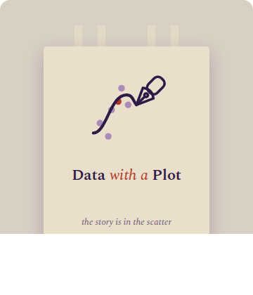</span>
      <span class="project-card-tag">Tote · Mockup</span>
      <p class="project-card-title">Field Tote</p>
      <p class="project-card-desc">The mark and wordmark on canvas, with "the story is in the scatter" underneath.</p>
    </div>

    <div class="project-card">
      <span class="swag-art">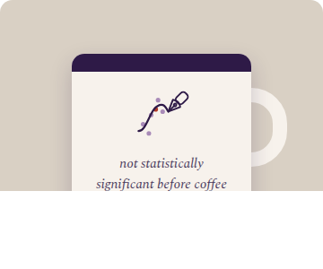</span>
      <span class="project-card-tag">Mug · Mockup</span>
      <p class="project-card-title">The Coffee Mug</p>
      <p class="project-card-desc">"Not statistically significant before coffee." The honest one.</p>
    </div>

    <div class="project-card">
      <span class="swag-art">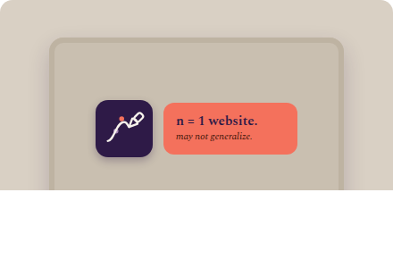</span>
      <span class="project-card-tag">Laptop · Mockup</span>
      <p class="project-card-title">Laptop Decal</p>
      <p class="project-card-desc">The mark and "n = 1 website. May not generalize." for your lid.</p>
    </div>

    <div class="project-card">
      <span class="swag-art">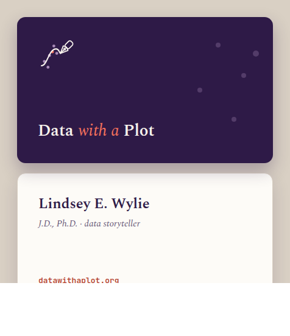</span>
      <span class="project-card-tag">Business Card · Mockup</span>
      <p class="project-card-title">The Business Card</p>
      <p class="project-card-desc">The identity on a card: "bright lines vs. the people in between."</p>
    </div>

    <div class="project-card">
      <span class="swag-art">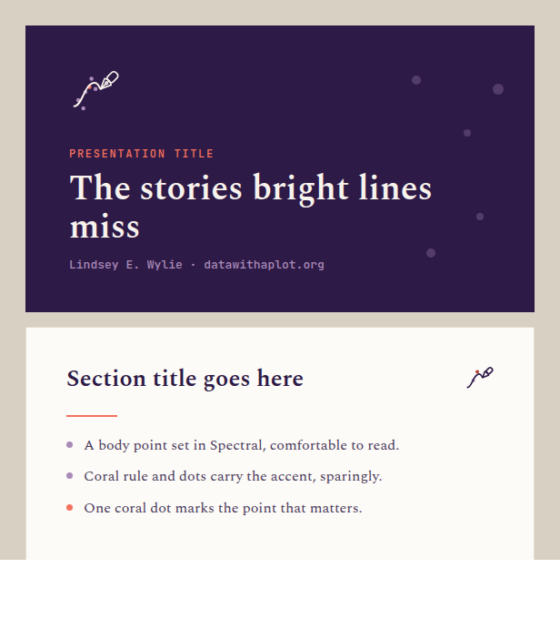</span>
      <span class="project-card-tag">Slides · Mockup</span>
      <p class="project-card-title">Slide Template</p>
      <p class="project-card-desc">A title and content slide in the brand: "The stories bright lines miss."</p>
    </div>

  </div>
</section>

</div>
```
