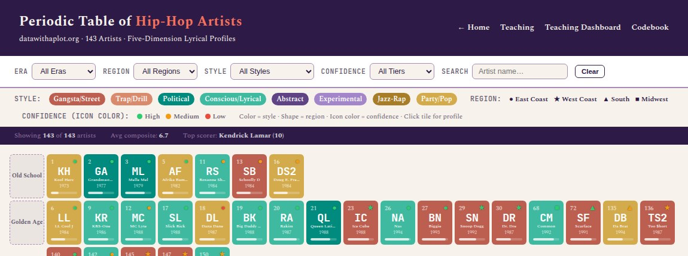
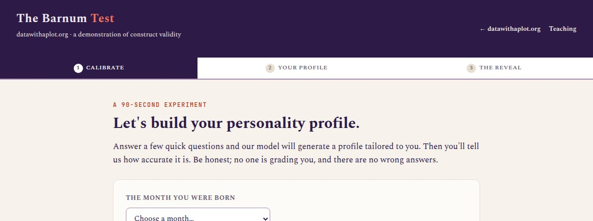
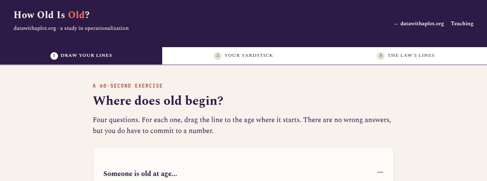
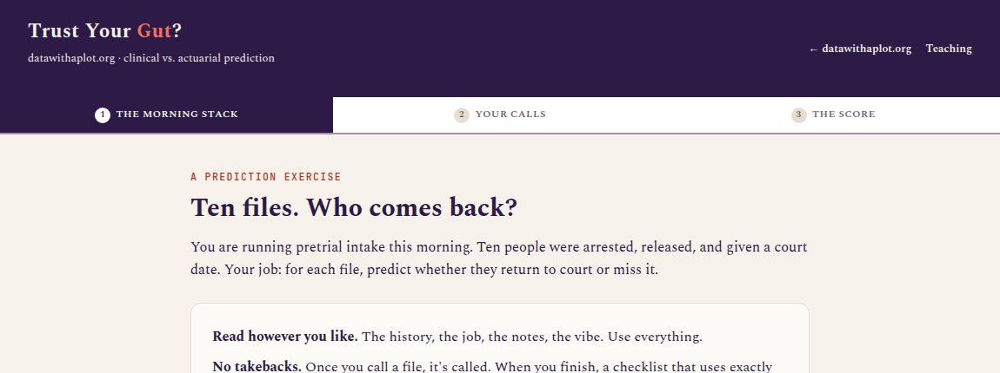
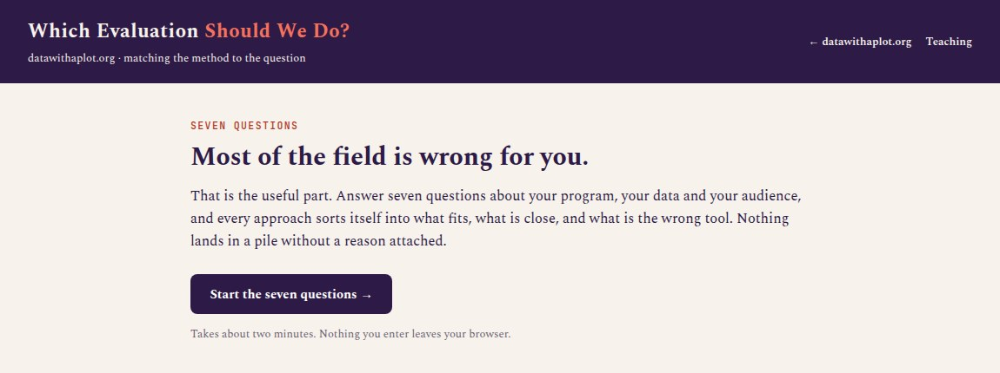
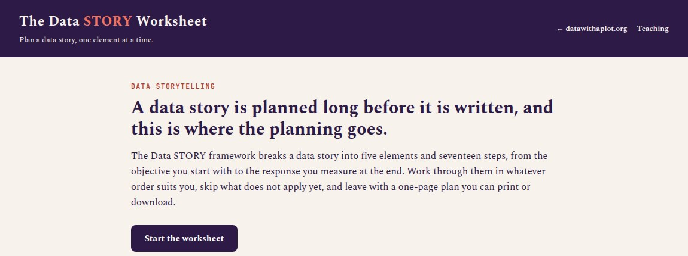

```{=html}
<div class="page-header container">
  <p class="page-header-label">Education</p>
  <h1 class="page-header-title">Teaching</h1>
  <p class="page-header-sub" style="font-style:italic;">
    Each exercise asks for a quick judgment and then shows what shaped it; the
    planning tools work through an evaluation or report of your own.
  </p>
  <p style="color:#6A5F72; font-size:0.9rem; margin-top:0.75rem;">
    More in <a href="https://www.ncsc.org/sites/default/files/media/document/NCSC-Trends-2025.pdf"><em>Cultivating
    a Court's Data STORY</em></a>, Trends in State Courts, 2025. Presented at the
    National Association for Court Management.
  </p>
</div>
```

## Warm-Ups {#short-exercises .section-heading data-eyebrow="01 · short exercises"}

Each starts with a quick call about something familiar, such as a favorite
rapper or the age at which someone becomes old, and then takes apart what went
into it.

```{=html}
<div class="project-grid project-grid--pairs container">

  <div class="project-card">
    <a href="../hiphop/hiphop_periodic_table.html" class="project-card-thumb" aria-hidden="true" tabindex="-1">
      
    </a>
    <span class="project-card-tag">Exercise · Measurement</span>
    <p class="project-card-title">The Hip-Hop Periodic Table</p>
    <p class="project-card-desc">
      Score a favorite rapper on gut feeling, then compare that score with a table
      of 187 hip-hop acts rated on five parts of lyricism, and see how much
      depends on what you decided to measure.
    </p>
    <a href="../hiphop/hiphop_periodic_table.html" class="project-card-cta">
      Explore the periodic table →
    </a>
    <p class="project-card-companion">
      Companion materials:
      <a href="../hiphop/hiphop_dashboard.html">analytics dashboard</a> ·
      <a href="../hiphop/data_dictionary.html">data dictionary</a>
    </p>
  </div>

  <div class="project-card">
    <a href="../barnum/barnum_test.html" class="project-card-thumb" aria-hidden="true" tabindex="-1">
      
    </a>
    <span class="project-card-tag">Exercise · Measurement</span>
    <p class="project-card-title">The Barnum Test</p>
    <p class="project-card-desc">
      A short personality profile that almost everyone rates as accurate, which
      is exactly the problem it is built to show.
    </p>
    <a href="../barnum/barnum_test.html" class="project-card-cta">
      Take the Barnum Test →
    </a>
  </div>

  <div class="project-card">
    <a href="../howold/how_old_is_old.html" class="project-card-thumb" aria-hidden="true" tabindex="-1">
      
    </a>
    <span class="project-card-tag">Exercise · Definitions</span>
    <p class="project-card-title">How Old Is Old?</p>
    <p class="project-card-desc">
      Set the age at which someone becomes old, a senior, or too old to drive,
      then see how far apart your own lines sit and where the law draws the same
      lines.
    </p>
    <a href="../howold/how_old_is_old.html" class="project-card-cta">
      Try How Old Is Old? →
    </a>
  </div>

  <div class="project-card">
    <a href="../gut/trust_your_gut.html" class="project-card-thumb" aria-hidden="true" tabindex="-1">
      
    </a>
    <span class="project-card-tag">Exercise · Prediction</span>
    <p class="project-card-title">Trust Your Gut?</p>
    <p class="project-card-desc">
      Read ten case files, predict who returns to court, and then see your calls
      scored against a checklist that uses exactly two facts.
    </p>
    <a href="../gut/trust_your_gut.html" class="project-card-cta">
      Trust your gut? →
    </a>
  </div>

</div>
```

## The STORY Framework {#planning-tools .section-heading data-eyebrow="02 · planning tools"}

These tools follow the STORY framework from my Trends chapter (Strategy, Target
audience, Observations, Representations, Yield); the evaluation picker comes
first because a story needs findings before it can be told.

```{=html}
<div class="project-grid project-grid--pairs container">

  <div class="project-card">
    <a href="../evalpicker/eval_picker.html" class="project-card-thumb" aria-hidden="true" tabindex="-1">
      
    </a>
    <span class="project-card-tag">Planning Tool · Evaluation</span>
    <p class="project-card-title">Which Evaluation Should We&nbsp;Do?</p>
    <p class="project-card-desc">
      Answer up to seven questions about your program, and every evaluation
      approach sorts into what fits, what is ruled out, and what could fit with
      more time or data.
    </p>
    <a href="../evalpicker/eval_picker.html" class="project-card-cta">
      Open the evaluation picker →
    </a>
  </div>

  <div class="project-card">
    <a href="../datastory/story_worksheet.html" class="project-card-thumb" aria-hidden="true" tabindex="-1">
      
    </a>
    <span class="project-card-tag">Planning Tool · Data Storytelling</span>
    <p class="project-card-title">The Data STORY Worksheet</p>
    <p class="project-card-desc">
      The five elements of a data story, strategy through yield, laid out as
      seventeen steps you can fill in, with a one-page plan to print or download
      at the end. It will not write the story for you, but it will show you which
      parts you have not thought through yet.
    </p>
    <a href="../datastory/story_worksheet.html" class="project-card-cta">
      Open the worksheet →
    </a>
    <p class="project-card-companion">
      Companion tool:
      <a href="../formatpicker/format_picker.html">format picker</a>
      (which deliverable fits)
    </p>
  </div>

</div>
```

---

## The Usual Subjects {#the-usual-subjects .section-heading data-eyebrow="03 · topics"}

**Measurement and metrics:** building performance measures that hold up, and
knowing when a composite score helps and when it misleads.

**Data visualization:** choosing the chart that matches your argument, and
showing uncertainty instead of false precision.

**Program evaluation:** matching the evaluation to the question and the
program's stage, and knowing what must be in place before outcomes mean
anything.

**Data storytelling:** turning findings into a story a specific audience can
act on, with a narrator they trust and a call to action you can measure.
